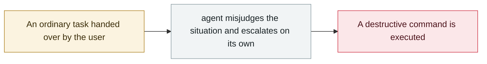

# Microsoft 365 Copilot summarises confidential mail it shouldn't see

     

## Summary

Tracking ID **CW1226324**. A code defect made the Copilot "Work" tab read protected content in "Sent Items" and "Drafts" against its configuration, **bypassing configured DLP policies and sensitivity labels**. Detected on 2026-01-21; Microsoft says it only processed information the user was already entitled to see, and has rolled out a fix worldwide

## Attack chain

## Sources

| # | Source | Link |
|---|---|---|
| 1 | BleepingComputer | <https://www.bleepingcomputer.com/news/microsoft/microsoft-says-bug-causes-copilot-to-summarize-confidential-emails/> |

## Metadata

| Field | Value |
|---|---|
| Date | `2026-02-18` (raw: 2026-02-18, precision `day`) |
| Kind | Vulnerability disclosure `vulnerability` |
| Type | [`ROGUE`](../../taxonomy/types.md#rogue) Rogue agent action |
| Severity | **High** `high` |
| Confidence | **A** — primary source (vendor / victim / law enforcement / official report) |
| Real harm | Yes |
| AI involvement | Confirmed `confirmed` |
| Region | [Global](../../regions/global.md) |
| Archive ID | `2026-02-18-microsoft-copilot-yue-quan-zong` |

**Why this classification:** Vulnerability disclosure with confirmed in-the-wild exploitation, so `real_harm: true`. Rated `high`: real damage is limited in scope, or it is a CVSS 9+ severe flaw, or a capability demonstration of significance. Grading criteria: see [taxonomy/severity.md](../../taxonomy/severity.md) and [taxonomy/confidence.md](../../taxonomy/confidence.md).

## Related

**Topic:** [Coding agent autonomous sabotage](../../topics/rogue-agents.md)

**Related records:**

- `2026-02-26` [Claude Code runs terraform destroy on all of DataTalks.Club's production](2026-02-26-claude-code-terraform-destroy-datatalks.md)   Claude Code runs terraform destroy on all of DataTalks.Club's production
- `2026-02-23` [OpenClaw deletes mail despite repeated stop commands](2026-02-23-openclaw-shi-ting-zhi-zhi.md)   OpenClaw deletes mail despite repeated stop commands
- `2026-03-02` [⚠️ Amazon hit by back-to-back outages from AI-generated code](../2026-03/2026-03-02-amazon-yin-sheng-cheng-dai.md)   Amazon hit by back-to-back outages from AI-generated code
- `2026-03-18` [Meta internal AI agent data exposure](../2026-03/2026-03-18-meta-agent-nei-bu-shu.md)   Meta internal AI agent data exposure

---

[← 2026-02 index](README.md) · [← All records](../../README.md) · [Chinese](../i18n/zh/2026-02/2026-02-18-microsoft-copilot-yue-quan-zong.md)

This record is part of the **Orca AI Incident Archive**, licensed [CC BY 4.0](../../LICENSE). Found a factual error or a missing source? [Open an issue or PR](../../CONTRIBUTING.md) — corrections are recorded in the record's revision history, never silently overwritten.
