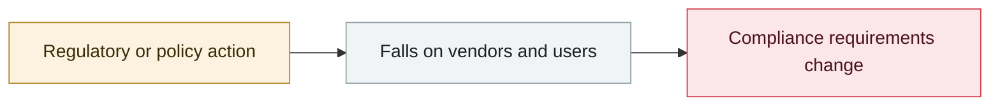

# Microsoft: don't run OpenClaw on ordinary work machines

     

## Summary

Microsoft's security blog formally recommends treating OpenClaw as **untrusted code execution with persistent credentials**, and states plainly: "**running it on a standard personal or enterprise workstation is not appropriate.**" The reasoning: it has limited built-in security controls, yet it can ingest untrusted text, download and execute code from outside and act with the credentials it has been granted — **the execution boundary has moved from static application code to dynamically supplied content, and the supporting controls have not kept up**. Three classes of risk are listed: exfiltration of credentials and accessible data, the agent's persistent state being rewritten so that it takes orders from an attacker, and the host environment falling because the agent fetches and executes malicious code. If it must be evaluated, do so in a fully isolated dedicated VM or on a separate physical machine, with dedicated non-privileged credentials, touching only non-sensitive data, with continuous monitoring plus a rebuild plan.

💡 **A mainstream vendor publicly discouraging the use of a popular tool on work devices — the only such case in this archive**

## Attack chain

## Sources

| # | Source | Link |
|---|---|---|
| 1 | Microsoft Security Blog | <https://www.microsoft.com/en-us/security/blog/2026/02/19/running-openclaw-safely-identity-isolation-runtime-risk/> |

## Metadata

| Field | Value |
|---|---|
| Date | `2026-02-19` (raw: 2026-02-19, precision `day`) |
| Kind | Policy & regulation `policy` |
| Type | [`GOV`](../../taxonomy/types.md#gov) Governance & policy |
| Severity | **Info** `info` |
| Confidence | **A** — primary source (vendor / victim / law enforcement / official report) |
| Real harm | n/a |
| AI involvement | Confirmed `confirmed` |
| Region | [Global](../../regions/global.md) |
| Archive ID | `2026-02-19-openclaw-wei-ruan-pu-tong` |

**Why this classification:** Policy / regulatory action, not counted in incident statistics; `severity` is recorded as `info`. Grading criteria: see [taxonomy/severity.md](../../taxonomy/severity.md) and [taxonomy/confidence.md](../../taxonomy/confidence.md).

## Related

**Topic:** [Defense & governance](../../topics/defense.md)

**Related records:**

- `2026-02-05` [GPT-5.3-Codex rated "High" for cyber capability](2026-02-05-gpt-codex-high.md)   GPT-5.3-Codex rated "High" for cyber capability
- `2026-02-05` [Claude Opus 4.6 finds 500+ zero-days in open-source projects](2026-02-05-claude-opus-kai-yuan-xiang.md)   Claude Opus 4.6 finds 500+ zero-days in open-source projects
- `2026-02-13` [ChatGPT introduces Lockdown Mode](2026-02-13-chatgpt-lockdown-mode.md)   ChatGPT introduces Lockdown Mode
- `2026-02-18` [Anthropic, "Measuring AI agent autonomy in practice"](2026-02-18-anthropic-measuring-agent-autonomy.md)   Anthropic, "Measuring AI agent autonomy in practice"

---

[← 2026-02 index](README.md) · [← All records](../../README.md) · [Chinese](../i18n/zh/2026-02/2026-02-19-openclaw-wei-ruan-pu-tong.md)

This record is part of the **Orca AI Incident Archive**, licensed [CC BY 4.0](../../LICENSE). Found a factual error or a missing source? [Open an issue or PR](../../CONTRIBUTING.md) — corrections are recorded in the record's revision history, never silently overwritten.
