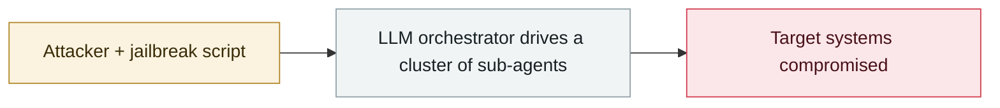

# AI-augmented actor compromises 600+ FortiGate devices

     

## Summary

AWS Security: a Russian-speaking actor compromised 600+ FortiGate devices worldwide **in five weeks**. **No zero-days** were used — only scanning of publicly exposed management ports plus weak passwords. AI acted as a "force multiplier", automating reconnaissance, developing custom tooling and generating attack plans; a self-built MCP framework, **ARXON**, wired LLMs into the intrusion workflow (DCSync/Impacket credential theft, attacks on Veeam backups). The actor's own skill level is moderate, but AI greatly amplified the scale of the operation

## Attack chain

## Sources

| # | Source | Link |
|---|---|---|
| 1 | AWS Security | <https://aws.amazon.com/jp/blogs/security/ai-augmented-threat-actor-accesses-fortigate-devices-at-scale/> |
| 2 | BleepingComputer | <https://www.bleepingcomputer.com/news/security/amazon-ai-assisted-hacker-breached-600-fortigate-firewalls-in-5-weeks/> |
| 3 | Cyber&Ramen technical analysis | <https://cyberandramen.net/2026/02/21/llms-in-the-kill-chain-inside-a-custom-mcp-targeting-fortigate-devices-across-continents/> |

## Metadata

| Field | Value |
|---|---|
| Date | `2026-02-20` (raw: 2026-02-20, precision `day`) |
| Kind | Incident `incident` |
| Type | [`WEAPON`](../../taxonomy/types.md#weapon) Agent used as a weapon |
| Severity | **Critical** `critical` |
| Confidence | **A** — primary source (vendor / victim / law enforcement / official report) |
| Real harm | Yes |
| AI involvement | Confirmed `confirmed` |
| Region | [Global](../../regions/global.md) |
| Archive ID | `2026-02-20-fortigate-600-devices-compromised` |

**Why this classification:** Real incident with a confirmed victim. Rated `critical`: confirmed real damage at the multi-organization / government / critical-infrastructure / supply-chain-worm level, or a first-of-its-kind capability milestone with real victims. Grading criteria: see [taxonomy/severity.md](../../taxonomy/severity.md) and [taxonomy/confidence.md](../../taxonomy/confidence.md).

## Related

**Topic:** [Offensive AI capability evolution](../../topics/offensive-ai.md)

**Related records:**

- `2026-02-25` [Nine Mexican government agencies breached](2026-02-25-mexico-nine-agencies-breached.md)   Nine Mexican government agencies breached
- `2026-02-28` [CodeWall breaches McKinsey's internal "Lilli" AI platform](2026-02-28-codewall-breaches-mckinsey-lilli.md)   CodeWall breaches McKinsey's internal "Lilli" AI platform
- `2026-01-01` [Claude Code sprays credentials at a Mexican water utility's OT network](../2026-01/2026-01-01-ot-claude-code.md)   Claude Code sprays credentials at a Mexican water utility's OT network
- `2026-03-06` [Microsoft, "AI as tradecraft"](../2026-03/2026-03-06-microsoft-as-tradecraft.md)   Microsoft, "AI as tradecraft"

---

[← 2026-02 index](README.md) · [← All records](../../README.md) · [Chinese](../i18n/zh/2026-02/2026-02-20-fortigate-600-devices-compromised.md)

This record is part of the **Orca AI Incident Archive**, licensed [CC BY 4.0](../../LICENSE). Found a factual error or a missing source? [Open an issue or PR](../../CONTRIBUTING.md) — corrections are recorded in the record's revision history, never silently overwritten.
