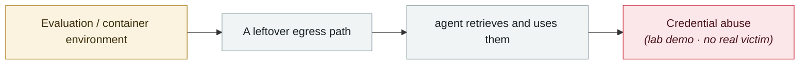

# Check Point publishes two Claude Code CVEs

      

> [!WARNING]
> **This record contains disputed or not fully confirmed facts**; the claims of each party are kept side by side in the body, so do not cite any single one of them in isolation.

## Summary

CVE-2025-59536 (a command can execute before the trust dialog appears) plus CVE-2026-21852 (`ANTHROPIC_BASE_URL` redirection steals the API key). **Anthropic fixed both before public disclosure**

⚠️ The v1 claim that "the attacker used Claude Code as a C2 for 18 days" could not be substantiated and appears to be a garbled version of this story; it was removed in v2

## Attack chain

## Sources

| # | Source | Link |
|---|---|---|
| 1 | Check Point | <https://research.checkpoint.com/2026/rce-and-api-token-exfiltration-through-claude-code-project-files-cve-2025-59536/> |
| 2 | THN | <https://thehackernews.com/2026/02/claude-code-flaws-allow-remote-code.html> |

## Metadata

| Field | Value |
|---|---|
| Date | `2026-02-27` (raw: 2026-02-27, precision `day`) |
| Kind | Research demo `research` |
| Type | [`SANDBOX`](../../taxonomy/types.md#sandbox) Sandbox escape · [`CRED`](../../taxonomy/types.md#cred) Credential abuse |
| Severity | **High** `high` |
| Confidence | **A** — primary source (vendor / victim / law enforcement / official report) |
| Real harm | No |
| AI involvement | Confirmed `confirmed` |
| Region | [Global](../../regions/global.md) |
| Archive ID | `2026-02-27-check-point-claude-code` |

**Why this classification:** Controlled demo by a research lab or vendor, `real_harm: false`; the record marks when the attack surface became public. Rated `high`: real damage is limited in scope, or it is a CVSS 9+ severe flaw, or a capability demonstration of significance. Grading criteria: see [taxonomy/severity.md](../../taxonomy/severity.md) and [taxonomy/confidence.md](../../taxonomy/confidence.md).

## Related

**Topic:** [Frontier model autonomous overreach](../../topics/eval-escapes.md)

**Related records:**

- `2026-02-01` [Infostealers start harvesting OpenClaw configs and gateway tokens](2026-02-01-openclaw-xin-xi-qie-qu.md)   Infostealers start harvesting OpenClaw configs and gateway tokens
- `2026-01-31` [Moltbook database fully open](../2026-01/2026-01-31-moltbook-open-database.md)   Moltbook database fully open
- `2026-03-01` [Hades: a sustained campaign turning AI coding assistants into the attack surface](../2026-03/2026-03-01-hades-campaign-ai-coding-assistants.md)   Hades: a sustained campaign turning AI coding assistants into the attack surface
- `2026-03-24` [Backdoored LiteLLM release](../2026-03/2026-03-24-litellm-backdoored-release.md)   Backdoored LiteLLM release

---

[← 2026-02 index](README.md) · [← All records](../../README.md) · [Chinese](../i18n/zh/2026-02/2026-02-27-check-point-claude-code.md)

This record is part of the **Orca AI Incident Archive**, licensed [CC BY 4.0](../../LICENSE). Found a factual error or a missing source? [Open an issue or PR](../../CONTRIBUTING.md) — corrections are recorded in the record's revision history, never silently overwritten.
