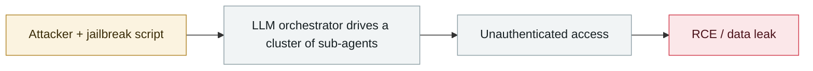

# CodeWall breaches McKinsey's internal "Lilli" AI platform

      

## Summary

The autonomous attack agent found an **unauthenticated SQL injection** in a public API endpoint → full read/write access to the production database → **46.5 million chat messages**, confidential documents and proprietary research data leaked. More seriously, it obtained **write access to the AI prompt layer** (able to manipulate answers and disable guardrails). Disclosed on 03-09

## Attack chain

## Sources

| # | Source | Link |
|---|---|---|
| 1 | CodeWall | <https://codewall.ai/blog/how-we-hacked-mckinseys-ai-platform> |

## Metadata

| Field | Value |
|---|---|
| Date | `2026-02-28` (raw: 2026-02-28, precision `day`) |
| Kind | Incident `incident` |
| Type | [`WEAPON`](../../taxonomy/types.md#weapon) Agent used as a weapon · [`INFRA`](../../taxonomy/types.md#infra) Agent infrastructure exposure |
| Severity | **Critical** `critical` |
| Confidence | **A** — primary source (vendor / victim / law enforcement / official report) |
| Real harm | Yes |
| AI involvement | Confirmed `confirmed` |
| Region | [United States](../../regions/us.md) |
| Archive ID | `2026-02-28-codewall-breaches-mckinsey-lilli` |

**Why this classification:** Real incident with a confirmed victim. Rated `critical`: confirmed real damage at the multi-organization / government / critical-infrastructure / supply-chain-worm level, or a first-of-its-kind capability milestone with real victims. Grading criteria: see [taxonomy/severity.md](../../taxonomy/severity.md) and [taxonomy/confidence.md](../../taxonomy/confidence.md).

## Related

**Topic:** [Offensive AI capability evolution](../../topics/offensive-ai.md) · [Agent infrastructure exposure](../../topics/agent-infra.md)

**Related records:**

- `2026-02-20` [AI-augmented actor compromises 600+ FortiGate devices](2026-02-20-fortigate-600-devices-compromised.md)   AI-augmented actor compromises 600+ FortiGate devices
- `2026-02-25` [Nine Mexican government agencies breached](2026-02-25-mexico-nine-agencies-breached.md)   Nine Mexican government agencies breached
- `2026-02-10` [15,200 OpenClaw control panels exposed](2026-02-10-openclaw-kong-zhi-mian-ban.md)   15,200 OpenClaw control panels exposed
- `2026-02-25` [OpenClaw ClawJacked (CVE-2026-25253)](2026-02-25-openclaw-clawjacked.md)   OpenClaw ClawJacked (CVE-2026-25253)

---

[← 2026-02 index](README.md) · [← All records](../../README.md) · [Chinese](../i18n/zh/2026-02/2026-02-28-codewall-breaches-mckinsey-lilli.md)

This record is part of the **Orca AI Incident Archive**, licensed [CC BY 4.0](../../LICENSE). Found a factual error or a missing source? [Open an issue or PR](../../CONTRIBUTING.md) — corrections are recorded in the record's revision history, never silently overwritten.
