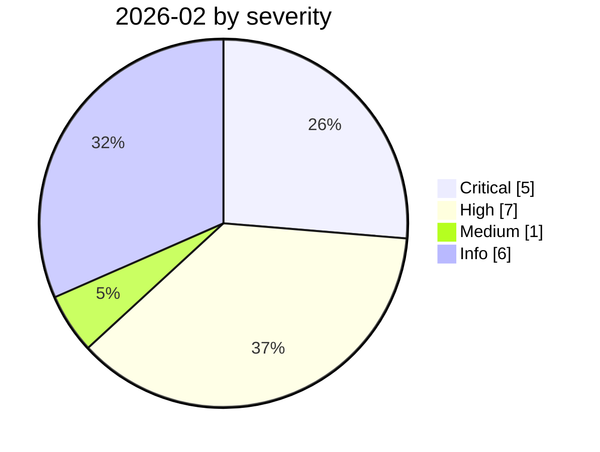

# 2026-02

<!-- BEGIN:summary -->
**19** records

    

## Records this month

| Date | Record | Type | Severity | Confidence | Real harm |
|---|---|---|---|---|---|
| `02-01` | [ClawHavoc campaign](2026-02-01-clawhavoc-zhan-yi.md) | `SUPPLY` | **High** | A | ✅ |
| `02-01` | [Infostealers start harvesting OpenClaw configs and gateway tokens](2026-02-01-openclaw-xin-xi-qie-qu.md) | `CRED` | **High** | B | ✅ |
| `02-01` | [Naver, Kakao and Karrot ban OpenClaw company-wide](2026-02-01-naver-kakao-karrot-openclaw.md) | `GOV` | Info | A | · |
| `02-05` | [Claude Opus 4.6 finds 500+ zero-days in open-source projects](2026-02-05-claude-opus-kai-yuan-xiang.md) | `GOV` | Info | A | · |
| `02-05` | [GPT-5.3-Codex rated "High" for cyber capability](2026-02-05-gpt-codex-high.md) | `GOV` | Info | A | · |
| `02-09` | ★ [Clinejection](2026-02-09-clinejection.md) | `SUPPLY` `IPI` | **Critical** | A | ✅ |
| `02-10` | [15,200 OpenClaw control panels exposed](2026-02-10-openclaw-kong-zhi-mian-ban.md) | `INFRA` | **High** | A | ✅ |
| `02-13` | [ChatGPT introduces Lockdown Mode](2026-02-13-chatgpt-lockdown-mode.md) | `GOV` | Info | A | · |
| `02-17` | [Boundary Point Jailbreaking (BPJ)](2026-02-17-boundary-point-jailbreaking-bpj.md) | `OTHER` | Medium | A | — |
| `02-18` | [Microsoft 365 Copilot summarises confidential mail it shouldn't see](2026-02-18-microsoft-copilot-yue-quan-zong.md) | `ROGUE` | **High** | A | ✅ |
| `02-18` | [Anthropic, "Measuring AI agent autonomy in practice"](2026-02-18-anthropic-measuring-agent-autonomy.md) | `GOV` | Info | A | · |
| `02-19` | [Microsoft: don't run OpenClaw on ordinary work machines](2026-02-19-openclaw-wei-ruan-pu-tong.md) | `GOV` | Info | A | · |
| `02-20` | ★ [AI-augmented actor compromises 600+ FortiGate devices](2026-02-20-fortigate-600-devices-compromised.md) | `WEAPON` | **Critical** | A | ✅ |
| `02-23` | [OpenClaw deletes mail despite repeated stop commands](2026-02-23-openclaw-shi-ting-zhi-zhi.md) | `ROGUE` | **High** | A | ✅ |
| `02-25` | ★ [Nine Mexican government agencies breached](2026-02-25-mexico-nine-agencies-breached.md) | `WEAPON` | **Critical** | A | ✅ |
| `02-25` | [OpenClaw ClawJacked (CVE-2026-25253)](2026-02-25-openclaw-clawjacked.md) | `INFRA` | **High** | A | — |
| `02-26` | ★ [Claude Code runs terraform destroy on all of DataTalks.Club's production](2026-02-26-claude-code-terraform-destroy-datatalks.md) | `ROGUE` | **Critical** | A | ✅ |
| `02-27` | [Check Point publishes two Claude Code CVEs](2026-02-27-check-point-claude-code.md) ⚠️ | `SANDBOX` `CRED` | **High** | A | — |
| `02-28` | ★ [CodeWall breaches McKinsey's internal "Lilli" AI platform](2026-02-28-codewall-breaches-mckinsey-lilli.md) | `WEAPON` `INFRA` | **Critical** | A | ✅ |

★ = `critical` · ⚠️ = disputed facts or attribution · real harm: ✅ confirmed victim / — none / · not applicable (policy and intelligence reports)
<!-- END:summary -->

<!-- BEGIN:nav -->
---

[← 2026-01](../2026-01/README.md) · [Archive index](../../README.md) · [By type](../../taxonomy/types.md) · [2026-03 →](../2026-03/README.md)
<!-- END:nav -->
