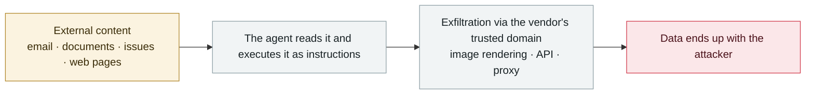

# Claudy Day: a three-flaw chain in claude.ai

      

## Summary

The full attack pipeline disclosed by Oasis Security, chained from three flaws: (1) invisible prompt injection on claude.ai via a **URL parameter**, (2) a data exfiltration channel through the **Anthropic Files API**, and (3) an **open redirect** on claude.ai.

Delivery was by **buying Google ads** — the ads showed a trusted claude.com link but took users to a poisoned redirect point and then into a crafted `claude.ai/new?q=` URL that silently exfiltrated sensitive data from the user's conversation history.

⚠️ **The most notable point: no integration, tool or MCP server is required — this hits the out-of-the-box default claude.ai session**. The prompt injection part has been fixed; the rest is being handled

⚠️ v2 was mistakenly placed on 2026-05-27; v3 corrects it to the Oasis disclosure date

## Attack chain

## Sources

| # | Source | Link |
|---|---|---|
| 1 | Oasis Security | <https://www.oasis.security/blog/claude-ai-prompt-injection-data-exfiltration-vulnerability> |
| 2 | technical report | <https://www.oasis.security/resources/reports/claude-ai-prompt-injection-vulnerability-technical-report> |
| 3 | Dark Reading | <https://www.darkreading.com/vulnerabilities-threats/claudy-day-trio-flaws-claude-users-data-theft> |

## Metadata

| Field | Value |
|---|---|
| Date | `2026-03-01` (raw: 2026-03, precision `month`) |
| Kind | Incident `incident` |
| Type | [`IPI`](../../taxonomy/types.md#ipi) Indirect prompt injection · [`EXFIL`](../../taxonomy/types.md#exfil) Data exfiltration |
| Severity | **High** `high` |
| Confidence | **A** — primary source (vendor / victim / law enforcement / official report) |
| Real harm | No |
| AI involvement | Confirmed `confirmed` |
| Region | [Global](../../regions/global.md) |
| Archive ID | `2026-03-01-claudy-day-claude-ai` |

**Why this classification:** Real incident without a confirmed specific victim. Rated `high`: real damage is limited in scope, or it is a CVSS 9+ severe flaw, or a capability demonstration of significance. Grading criteria: see [taxonomy/severity.md](../../taxonomy/severity.md) and [taxonomy/confidence.md](../../taxonomy/confidence.md).

## Related

**Topic:** [Zero-click data exfiltration chain](../../topics/zero-click-exfil.md)

**Related records:**

- `2026-03-16` [CellShock: data exfiltration through an AI spreadsheet tool](2026-03-16-cellshock-biao-ge-gong-ju.md)   CellShock: data exfiltration through an AI spreadsheet tool
- `2026-02-09` [Clinejection](../2026-02/2026-02-09-clinejection.md)   Clinejection
- `2026-04-01` [Three CVEs in the Claude Code GitHub Action: a PR title steals your API key](../2026-04/2026-04-01-claude-code-github-action.md)   Three CVEs in the Claude Code GitHub Action: a PR title steals your API key
- `2026-04-15` [ShareLeak (CVE-2026-21520) and PipeLeak](../2026-04/2026-04-15-shareleak-pipeleak.md)   ShareLeak (CVE-2026-21520) and PipeLeak

---

[← 2026-03 index](README.md) · [← All records](../../README.md) · [Chinese](../i18n/zh/2026-03/2026-03-01-claudy-day-claude-ai.md)

This record is part of the **Orca AI Incident Archive**, licensed [CC BY 4.0](../../LICENSE). Found a factual error or a missing source? [Open an issue or PR](../../CONTRIBUTING.md) — corrections are recorded in the record's revision history, never silently overwritten.
