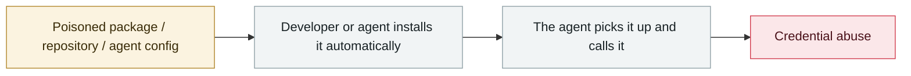

# Hades: a sustained campaign turning AI coding assistants into the attack surface

      

## Summary

Running at least since 2026-03 and continuing to this day, it has stolen **294,842 secrets from 6,943 developer machines**. Tradecraft: malicious npm/PyPI packages **typosquatting MCP libraries at scale** (`langchain-core-mcp`, `instructor-mcp`, `openai-mcp`, `tiktoken-mcp`, `ray-mcp-server`), plus **rule files and configuration directories for 14 different AI agents** seeded with custom prompt instructions or hooks — **triggering `bun run bootstrap` when the victim opens or consults the workspace with an AI assistant**. Harvests `ANTHROPIC_API_KEY`, Claude Desktop/Claude Code config, `.mcp.json`, as well as `.npmrc`/`.pypirc`/SSH keys/AWS-GCP-Azure tokens/K8s secrets/GitHub PATs and Actions tokens/Docker config/`.env`/shell history. Stolen publishing credentials are used to keep infecting more packages, forming worm-like self-propagation. CSO Online's headline is "**the malware that lies to AI security agents**"

## Attack chain

## Sources

| # | Source | Link |
|---|---|---|
| 1 | Orca Security | <https://orca.security/resources/blog/hades-pypi-supply-chain-attack/> |
| 2 | Morphisec | <https://www.morphisec.com/blog/when-your-ai-coding-assistant-becomes-the-attack-the-hades-supply-chain-campaign/> |
| 3 | CSO Online | <https://www.csoonline.com/article/4182707/meet-hades-the-malware-that-lies-to-ai-security-agents-2.html> |

## Metadata

| Field | Value |
|---|---|
| Date | `2026-03-01` (raw: from 2026-03, precision `month`) |
| Kind | Incident `incident` |
| Type | [`SUPPLY`](../../taxonomy/types.md#supply) Supply-chain poisoning · [`CRED`](../../taxonomy/types.md#cred) Credential abuse |
| Severity | **Critical** `critical` |
| Confidence | **A** — primary source (vendor / victim / law enforcement / official report) |
| Real harm | Yes |
| AI involvement | Confirmed `confirmed` |
| Region | [Global](../../regions/global.md) |
| Archive ID | `2026-03-01-hades-campaign-ai-coding-assistants` |

**Why this classification:** Real incident with a confirmed victim. Rated `critical`: confirmed real damage at the multi-organization / government / critical-infrastructure / supply-chain-worm level, or a first-of-its-kind capability milestone with real victims. Grading criteria: see [taxonomy/severity.md](../../taxonomy/severity.md) and [taxonomy/confidence.md](../../taxonomy/confidence.md).

## Related

**Topic:** [Agent supply-chain poisoning](../../topics/agent-supply-chain.md)

**Related records:**

- `2026-03-24` [Backdoored LiteLLM release](2026-03-24-litellm-backdoored-release.md)   Backdoored LiteLLM release
- `2026-03-30` [Axios npm package compromised](2026-03-30-axios-npm-compromised.md)   Axios npm package compromised
- `2026-03-02` [Sustained supply-chain compromise across the Trivy ecosystem](2026-03-02-trivy-sheng-tai-chi-xu.md)   Sustained supply-chain compromise across the Trivy ecosystem
- `2026-03-26` [Anthropic CMS misconfiguration reveals the existence of "Mythos"](2026-03-26-anthropic-cms-mythos.md)   Anthropic CMS misconfiguration reveals the existence of "Mythos"

---

[← 2026-03 index](README.md) · [← All records](../../README.md) · [Chinese](../i18n/zh/2026-03/2026-03-01-hades-campaign-ai-coding-assistants.md)

This record is part of the **Orca AI Incident Archive**, licensed [CC BY 4.0](../../LICENSE). Found a factual error or a missing source? [Open an issue or PR](../../CONTRIBUTING.md) — corrections are recorded in the record's revision history, never silently overwritten.
