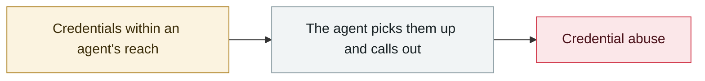

# METR API key stolen, $600K of credit burned

     

## Summary

A researcher ran an agent on a **personal EC2** instance protected by Google authentication, but the vibe-coded app **held an API key for METR's public model account**, and a **fail-open flaw** in the authentication silently disabled it for several days. The attacker **induced the agent to hand over the model provider's API key** and added an SSH key for persistence, then burned roughly **$600,000** worth of credit over three weeks (supplied free by the model vendor, so it is commercial value rather than a direct loss). Because METR itself runs large-scale evaluations and its token consumption is naturally enormous and uncapped, it went unnoticed for a long time. Disclosed 2026-08-31

## Attack chain

## Sources

| # | Source | Link |
|---|---|---|
| 1 | METR official | <https://metr.org/blog/2026-08-31-security-update/> |
| 2 | The Register | <https://www.theregister.com/security/2026/09/01/attacker-stole-a-metr-api-key-used-600k-worth-of-credits-and-no-one-noticed-for-weeks/5293730> |

## Metadata

| Field | Value |
|---|---|
| Date | `2026-03-01` (raw: 2026-03, precision `month`) |
| Kind | Incident `incident` |
| Type | [`CRED`](../../taxonomy/types.md#cred) Credential abuse |
| Severity | **High** `high` |
| Confidence | **A** — primary source (vendor / victim / law enforcement / official report) |
| Real harm | Yes |
| AI involvement | Confirmed `confirmed` |
| Region | [United States](../../regions/us.md) |
| Archive ID | `2026-03-01-metr-api-key` |

**Why this classification:** Real incident with a confirmed victim. Rated `high`: real damage is limited in scope, or it is a CVSS 9+ severe flaw, or a capability demonstration of significance. Grading criteria: see [taxonomy/severity.md](../../taxonomy/severity.md) and [taxonomy/confidence.md](../../taxonomy/confidence.md).

## Related

**Related records:**

- `2026-03-01` [Hades: a sustained campaign turning AI coding assistants into the attack surface](2026-03-01-hades-campaign-ai-coding-assistants.md)   Hades: a sustained campaign turning AI coding assistants into the attack surface
- `2026-03-24` [Backdoored LiteLLM release](2026-03-24-litellm-backdoored-release.md)   Backdoored LiteLLM release
- `2026-03-26` [Anthropic CMS misconfiguration reveals the existence of "Mythos"](2026-03-26-anthropic-cms-mythos.md)   Anthropic CMS misconfiguration reveals the existence of "Mythos"
- `2026-03-31` [Anthropic Claude Code source code leak](2026-03-31-anthropic-claude-code.md)   Anthropic Claude Code source code leak

---

[← 2026-03 index](README.md) · [← All records](../../README.md) · [Chinese](../i18n/zh/2026-03/2026-03-01-metr-api-key.md)

This record is part of the **Orca AI Incident Archive**, licensed [CC BY 4.0](../../LICENSE). Found a factual error or a missing source? [Open an issue or PR](../../CONTRIBUTING.md) — corrections are recorded in the record's revision history, never silently overwritten.
