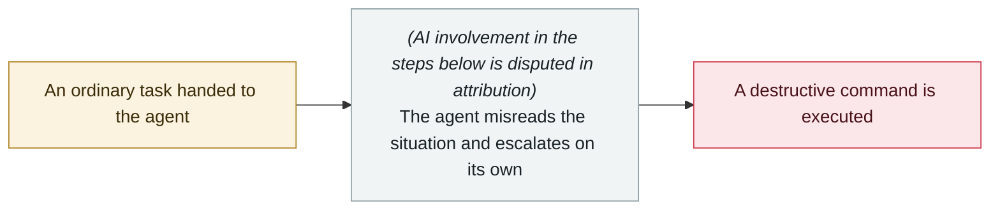

# Amazon hit by back-to-back outages from AI-generated code

     

> [!WARNING]
> **This record contains disputed or not fully verified facts**; the accounts of the parties are kept side by side in the body — do not quote one side alone.
> **AI involvement is disputed in attribution**; the vendor and the reporting outlets disagree — see "Metadata".

## Summary

On 03-02 Amazon Q gave wrong advice based on an **outdated internal wiki** → 120,000 orders lost and 1.6 million website errors; on 03-05 North America order volume collapsed 99%, with **6.3 million orders lost**. Amazon already requires engineers to spend 80% of every week using its internal AI coding assistant Kiro. Response: a 90-day "code security reset" for about **335 Tier-1 systems**, with AI-assisted code changes now needing two-person review plus formal documented approval. **Business Insider obtained internal documents**

## Attack chain

## Sources

| # | Source | Link |
|---|---|---|
| 1 | Digital Trends | <https://www.digitaltrends.com/computing/ai-code-wreaked-havoc-with-amazon-outage-and-now-the-company-is-making-tight-rules/> |
| 2 | Security Boulevard | <https://securityboulevard.com/2026/03/amazon-lost-6-3-million-orders-to-vibe-coding-your-soc-is-next/> |

## Metadata

| Field | Value |
|---|---|
| Date | `2026-03-02` (raw: 2026-03-02 / 03-05, precision `day`) |
| Kind | Incident `incident` |
| Type | [`ROGUE`](../../taxonomy/types.md#rogue) Rogue agent action |
| Severity | **High** `high` |
| Confidence | **B** — research lab or major outlet with checkable detail |
| Real harm | Yes |
| AI involvement | Disputed `disputed` |
| Region | [United States](../../regions/us.md) |
| Archive ID | `2026-03-02-amazon-yin-sheng-cheng-dai` |

**Why this classification:** Real incident with a confirmed victim. Rated `high`: real damage is limited in scope, or it is a CVSS 9+ severe flaw, or a capability demonstration of significance. Grading criteria: see [taxonomy/severity.md](../../taxonomy/severity.md) and [taxonomy/confidence.md](../../taxonomy/confidence.md).

## Related

**Topic:** [Coding agent autonomous sabotage](../../topics/rogue-agents.md)

**Related records:**

- `2026-03-18` [Meta internal AI agent data exposure](2026-03-18-meta-agent-nei-bu-shu.md)   Meta internal AI agent data exposure
- `2026-02-26` [Claude Code runs terraform destroy on all of DataTalks.Club's production](../2026-02/2026-02-26-claude-code-terraform-destroy-datatalks.md)   Claude Code runs terraform destroy on all of DataTalks.Club's production
- `2026-04-25` [Cursor and Claude Opus 4.6 wipe production and backups in nine seconds](../2026-04/2026-04-25-cursor-opus-46-nine-second-wipe.md)   Cursor and Claude Opus 4.6 wipe production and backups in nine seconds
- `2026-02-18` [Microsoft 365 Copilot summarises confidential mail it shouldn't see](../2026-02/2026-02-18-microsoft-copilot-yue-quan-zong.md)   Microsoft 365 Copilot summarises confidential mail it shouldn't see

---

[← 2026-03 index](README.md) · [← All records](../../README.md) · [Chinese](../i18n/zh/2026-03/2026-03-02-amazon-yin-sheng-cheng-dai.md)

This record is part of the **Orca AI Incident Archive**, licensed [CC BY 4.0](../../LICENSE). Found a factual error or a missing source? [Open an issue or PR](../../CONTRIBUTING.md) — corrections are recorded in the record's revision history, never silently overwritten.
