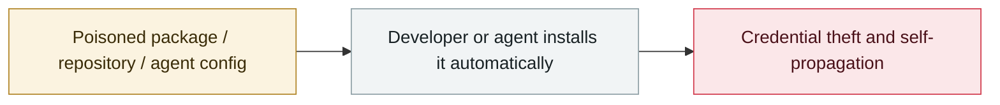

# Sustained supply-chain compromise across the Trivy ecosystem

     

## Summary

GitHub repository credentials were compromised to distribute a malicious binary (v0.69.4), container images and GitHub Actions (trivy-action, setup-trivy). **The operation against the Trivy VS Code extension on OpenVSX was an AI-assisted attack — it used the victim's local AI coding assistant to exfiltrate system data**. Also affected Checkmarx KICS, LiteLLM, Telnyx and Axios

## Attack chain

## Sources

| # | Source | Link |
|---|---|---|
| 1 | Aqua advisory | <https://github.com/aquasecurity/trivy/security/advisories/GHSA-69fq-xp46-6x23> |
| 2 | Socket | <https://socket.dev/blog/unauthorized-ai-agent-execution-code-published-to-openvsx-in-aqua-trivy-vs-code-extension> |
| 3 | Trend Micro | <https://www.trendmicro.com/ja_jp/jp-security/26/d/expertview-20260409-01.html> |

## Metadata

| Field | Value |
|---|---|
| Date | `2026-03-02` (raw: 2026-03-02, precision `day`) |
| Kind | Incident `incident` |
| Type | [`SUPPLY`](../../taxonomy/types.md#supply) Supply-chain poisoning |
| Severity | **High** `high` |
| Confidence | **A** — primary source (vendor / victim / law enforcement / official report) |
| Real harm | Yes |
| AI involvement | Confirmed `confirmed` |
| Region | [Global](../../regions/global.md) |
| Archive ID | `2026-03-02-trivy-sheng-tai-chi-xu` |

**Why this classification:** Real incident with a confirmed victim. Rated `high`: real damage is limited in scope, or it is a CVSS 9+ severe flaw, or a capability demonstration of significance. Grading criteria: see [taxonomy/severity.md](../../taxonomy/severity.md) and [taxonomy/confidence.md](../../taxonomy/confidence.md).

## Related

**Topic:** [Agent supply-chain poisoning](../../topics/agent-supply-chain.md)

**Related records:**

- `2026-03-01` [Hades: a sustained campaign turning AI coding assistants into the attack surface](2026-03-01-hades-campaign-ai-coding-assistants.md)   Hades: a sustained campaign turning AI coding assistants into the attack surface
- `2026-03-24` [Backdoored LiteLLM release](2026-03-24-litellm-backdoored-release.md)   Backdoored LiteLLM release
- `2026-03-30` [Axios npm package compromised](2026-03-30-axios-npm-compromised.md)   Axios npm package compromised
- `2026-02-09` [Clinejection](../2026-02/2026-02-09-clinejection.md)   Clinejection

---

[← 2026-03 index](README.md) · [← All records](../../README.md) · [Chinese](../i18n/zh/2026-03/2026-03-02-trivy-sheng-tai-chi-xu.md)

This record is part of the **Orca AI Incident Archive**, licensed [CC BY 4.0](../../LICENSE). Found a factual error or a missing source? [Open an issue or PR](../../CONTRIBUTING.md) — corrections are recorded in the record's revision history, never silently overwritten.
