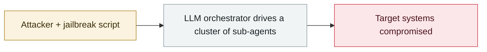

# Microsoft, "AI as tradecraft"

     

## Summary

North Korea-linked **Jasper Sleet and Coral Sleet** use LLMs across the whole chain — phishing, code generation, persona fabrication and infrastructure management

## Attack chain

## Sources

| # | Source | Link |
|---|---|---|
| 1 | Microsoft | <https://www.microsoft.com/en-us/security/blog/2026/03/06/ai-as-tradecraft-how-threat-actors-operationalize-ai/> |

## Metadata

| Field | Value |
|---|---|
| Date | `2026-03-06` (raw: 2026-03-06, precision `day`) |
| Kind | Threat report `report` |
| Type | [`WEAPON`](../../taxonomy/types.md#weapon) Agent used as a weapon |
| Severity | **Info** `info` |
| Confidence | **A** — primary source (vendor / victim / law enforcement / official report) |
| Real harm | n/a |
| AI involvement | Confirmed `confirmed` |
| Region | [Global](../../regions/global.md) |
| Archive ID | `2026-03-06-microsoft-as-tradecraft` |

**Why this classification:** Threat intelligence report covering several incidents; it is not counted as a single incident itself, so `severity` is recorded as `info`. Grading criteria: see [taxonomy/severity.md](../../taxonomy/severity.md) and [taxonomy/confidence.md](../../taxonomy/confidence.md).

## Related

**Topic:** [Offensive AI capability evolution](../../topics/offensive-ai.md)

**Related records:**

- `2026-02-20` [AI-augmented actor compromises 600+ FortiGate devices](../2026-02/2026-02-20-fortigate-600-devices-compromised.md)   AI-augmented actor compromises 600+ FortiGate devices
- `2026-02-25` [Nine Mexican government agencies breached](../2026-02/2026-02-25-mexico-nine-agencies-breached.md)   Nine Mexican government agencies breached
- `2026-02-28` [CodeWall breaches McKinsey's internal "Lilli" AI platform](../2026-02/2026-02-28-codewall-breaches-mckinsey-lilli.md)   CodeWall breaches McKinsey's internal "Lilli" AI platform
- `2026-04-08` [Aurora ransomware operators use Cursor Agent in live intrusions](../2026-04/2026-04-08-aurora-cursor-agent.md)   Aurora ransomware operators use Cursor Agent in live intrusions

---

[← 2026-03 index](README.md) · [← All records](../../README.md) · [Chinese](../i18n/zh/2026-03/2026-03-06-microsoft-as-tradecraft.md)

This record is part of the **Orca AI Incident Archive**, licensed [CC BY 4.0](../../LICENSE). Found a factual error or a missing source? [Open an issue or PR](../../CONTRIBUTING.md) — corrections are recorded in the record's revision history, never silently overwritten.
