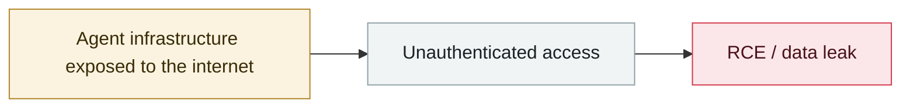

# McKinsey Lilli incident goes public

     

## Summary

See 2026-02-28

## Attack chain

## Sources

| # | Source | Link |
|---|---|---|
| 1 | CodeWall | <https://codewall.ai/blog/how-we-hacked-mckinseys-ai-platform> |

## Metadata

| Field | Value |
|---|---|
| Date | `2026-03-09` (raw: 2026-03-09, precision `day`) |
| Kind | Incident `incident` |
| Type | [`INFRA`](../../taxonomy/types.md#infra) Agent infrastructure exposure |
| Severity | **High** `high` |
| Confidence | **A** — primary source (vendor / victim / law enforcement / official report) |
| Real harm | No |
| AI involvement | Confirmed `confirmed` |
| Region | [United States](../../regions/us.md) |
| Archive ID | `2026-03-09-lilli-mai-ken-xi-shi` |

**Why this classification:** Real incident without a confirmed specific victim. Rated `high`: real damage is limited in scope, or it is a CVSS 9+ severe flaw, or a capability demonstration of significance. Grading criteria: see [taxonomy/severity.md](../../taxonomy/severity.md) and [taxonomy/confidence.md](../../taxonomy/confidence.md).

## Related

**Topic:** [Agent infrastructure exposure](../../topics/agent-infra.md)

**Related records:**

- `2026-03-27` [Langflow path traversal enables arbitrary file write](2026-03-27-langflow-lu-jing-chuan-yue.md)   Langflow path traversal enables arbitrary file write
- `2026-02-28` [CodeWall breaches McKinsey's internal "Lilli" AI platform](../2026-02/2026-02-28-codewall-breaches-mckinsey-lilli.md)   CodeWall breaches McKinsey's internal "Lilli" AI platform
- `2026-04-16` [MCPwn (CVE-2026-33032): nginx-ui MCP endpoint hit in the wild](../2026-04/2026-04-16-mcpwn-nginx-ui-in-the-wild.md)   MCPwn (CVE-2026-33032): nginx-ui MCP endpoint hit in the wild
- `2026-02-10` [15,200 OpenClaw control panels exposed](../2026-02/2026-02-10-openclaw-kong-zhi-mian-ban.md)   15,200 OpenClaw control panels exposed

---

[← 2026-03 index](README.md) · [← All records](../../README.md) · [Chinese](../i18n/zh/2026-03/2026-03-09-lilli-mai-ken-xi-shi.md)

This record is part of the **Orca AI Incident Archive**, licensed [CC BY 4.0](../../LICENSE). Found a factual error or a missing source? [Open an issue or PR](../../CONTRIBUTING.md) — corrections are recorded in the record's revision history, never silently overwritten.
