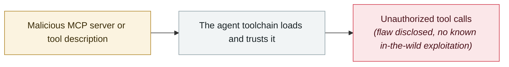

# Azure MCP Server SSRF privilege escalation (CVE-2026-26118)

     

## Summary

**CVSS 8.8**. Submit a **malicious URL in place of a normal Azure resource identifier** to an Azure MCP Server tool that accepts user parameters, and the MCP Server makes an outbound request to that URL, **possibly carrying its own managed identity token along with it** — a low-privilege attacker can thus capture that token and escalate privileges without administrator rights

## Attack chain

## Sources

| # | Source | Link |
|---|---|---|
| 1 | MSRC | <https://msrc.microsoft.com/update-guide/vulnerability/CVE-2026-26118> |
| 2 | NVD | <https://nvd.nist.gov/vuln/detail/CVE-2026-26118> |

## Metadata

| Field | Value |
|---|---|
| Date | `2026-03-10` (raw: 2026-03-10, precision `day`) |
| Kind | Vulnerability disclosure `vulnerability` |
| Type | [`MCP`](../../taxonomy/types.md#mcp) MCP & tool-chain |
| Severity | **Medium** `medium` |
| Confidence | **A** — primary source (vendor / victim / law enforcement / official report) |
| Real harm | No |
| AI involvement | Confirmed `confirmed` |
| Region | [Global](../../regions/global.md) |
| Archive ID | `2026-03-10-azure-mcp-server-ssrf` |

**Why this classification:** Vulnerability disclosure; as of archiving there is no evidence of in-the-wild exploitation, so `real_harm: false`. Rated `medium`: controlled demo, moderate flaw, or an incident limited to a single user / single machine. Grading criteria: see [taxonomy/severity.md](../../taxonomy/severity.md) and [taxonomy/confidence.md](../../taxonomy/confidence.md).

## Related

**Topic:** [Agent supply-chain poisoning](../../topics/agent-supply-chain.md)

**Related records:**

- `2026-04-16` [MCPwn (CVE-2026-33032): nginx-ui MCP endpoint hit in the wild](../2026-04/2026-04-16-mcpwn-nginx-ui-in-the-wild.md)   MCPwn (CVE-2026-33032): nginx-ui MCP endpoint hit in the wild
- `2026-04-15` [Windsurf zero-click MCP RCE (CVE-2026-30615)](../2026-04/2026-04-15-windsurf-mcp-rce.md)   Windsurf zero-click MCP RCE (CVE-2026-30615)
- `2026-05-07` [TrustFall: RCE on a single keypress](../2026-05/2026-05-07-trustfall-rce-yi-ci-hui.md)   TrustFall: RCE on a single keypress
- `2026-06-12` [Agentjacking: one public DSN hijacks AI coding agents](../2026-06/2026-06-12-agentjacking-public-dsn.md)   Agentjacking: one public DSN hijacks AI coding agents

---

[← 2026-03 index](README.md) · [← All records](../../README.md) · [Chinese](../i18n/zh/2026-03/2026-03-10-azure-mcp-server-ssrf.md)

This record is part of the **Orca AI Incident Archive**, licensed [CC BY 4.0](../../LICENSE). Found a factual error or a missing source? [Open an issue or PR](../../CONTRIBUTING.md) — corrections are recorded in the record's revision history, never silently overwritten.
