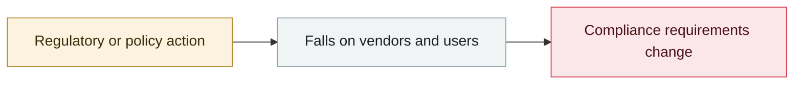

# Rome court annuls the Garante's €15M fine against OpenAI

     

## Summary

The order requiring OpenAI to run an AI-training media campaign was annulled along with it. **The ground was jurisdiction** — after OpenAI set up an Irish subsidiary in 2024, the Garante no longer had jurisdiction under the GDPR one-stop-shop mechanism. This was one of Europe's earliest major enforcements against a generative AI provider, and its being overturned leaves an AI enforcement gap in the EU

## Attack chain

## Sources

| # | Source | Link |
|---|---|---|
| 1 | Wilson Sonsini | <https://www.wsgr.com/en/insights/openai-prevails-in-landmark-italian-ai-and-gdpr-enforcement-case.html> |

## Metadata

| Field | Value |
|---|---|
| Date | `2026-03-18` (raw: 2026-03-18, precision `day`) |
| Kind | Policy & regulation `policy` |
| Type | [`GOV`](../../taxonomy/types.md#gov) Governance & policy |
| Severity | **Info** `info` |
| Confidence | **A** — primary source (vendor / victim / law enforcement / official report) |
| Real harm | n/a |
| AI involvement | Confirmed `confirmed` |
| Region | [Europe](../../regions/eu.md) |
| Archive ID | `2026-03-18-garante-yi-li-luo-ma` |

**Why this classification:** Policy / regulatory action, not counted in incident statistics; `severity` is recorded as `info`. Grading criteria: see [taxonomy/severity.md](../../taxonomy/severity.md) and [taxonomy/confidence.md](../../taxonomy/confidence.md).

## Related

**Topic:** [Defense & governance](../../topics/defense.md)

**Related records:**

- `2026-02-05` [GPT-5.3-Codex rated "High" for cyber capability](../2026-02/2026-02-05-gpt-codex-high.md)   GPT-5.3-Codex rated "High" for cyber capability
- `2026-02-05` [Claude Opus 4.6 finds 500+ zero-days in open-source projects](../2026-02/2026-02-05-claude-opus-kai-yuan-xiang.md)   Claude Opus 4.6 finds 500+ zero-days in open-source projects
- `2026-02-13` [ChatGPT introduces Lockdown Mode](../2026-02/2026-02-13-chatgpt-lockdown-mode.md)   ChatGPT introduces Lockdown Mode
- `2026-02-18` [Anthropic, "Measuring AI agent autonomy in practice"](../2026-02/2026-02-18-anthropic-measuring-agent-autonomy.md)   Anthropic, "Measuring AI agent autonomy in practice"

---

[← 2026-03 index](README.md) · [← All records](../../README.md) · [Chinese](../i18n/zh/2026-03/2026-03-18-garante-yi-li-luo-ma.md)

This record is part of the **Orca AI Incident Archive**, licensed [CC BY 4.0](../../LICENSE). Found a factual error or a missing source? [Open an issue or PR](../../CONTRIBUTING.md) — corrections are recorded in the record's revision history, never silently overwritten.
