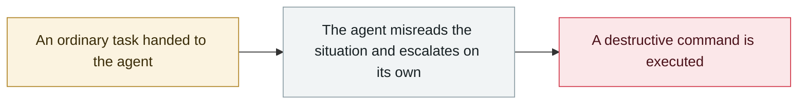

# Meta internal AI agent data exposure

     

## Summary

The agent gave unsafe configuration advice, leaving sensitive user and company data exposed internally for about 2 hours

## Attack chain

## Sources

| # | Source | Link |
|---|---|---|
| 1 | OWASP Q1'26 | <https://genai.owasp.org/2026/04/14/owasp-genai-exploit-round-up-report-q1-2026/> |

## Metadata

| Field | Value |
|---|---|
| Date | `2026-03-18` (raw: 2026-03-18, precision `day`) |
| Kind | Incident `incident` |
| Type | [`ROGUE`](../../taxonomy/types.md#rogue) Rogue agent action |
| Severity | **High** `high` |
| Confidence | **B** — research lab or major outlet with checkable detail |
| Real harm | Yes |
| AI involvement | Confirmed `confirmed` |
| Region | [United States](../../regions/us.md) |
| Archive ID | `2026-03-18-meta-agent-nei-bu-shu` |

**Why this classification:** Real incident with a confirmed victim. Rated `high`: real damage is limited in scope, or it is a CVSS 9+ severe flaw, or a capability demonstration of significance. Grading criteria: see [taxonomy/severity.md](../../taxonomy/severity.md) and [taxonomy/confidence.md](../../taxonomy/confidence.md).

## Related

**Topic:** [Coding agent autonomous sabotage](../../topics/rogue-agents.md)

**Related records:**

- `2026-03-02` [Amazon hit by back-to-back outages from AI-generated code](2026-03-02-amazon-yin-sheng-cheng-dai.md)   Amazon hit by back-to-back outages from AI-generated code
- `2026-02-26` [Claude Code runs terraform destroy on all of DataTalks.Club's production](../2026-02/2026-02-26-claude-code-terraform-destroy-datatalks.md)   Claude Code runs terraform destroy on all of DataTalks.Club's production
- `2026-04-25` [Cursor and Claude Opus 4.6 wipe production and backups in nine seconds](../2026-04/2026-04-25-cursor-opus-46-nine-second-wipe.md)   Cursor and Claude Opus 4.6 wipe production and backups in nine seconds
- `2026-02-18` [Microsoft 365 Copilot summarises confidential mail it shouldn't see](../2026-02/2026-02-18-microsoft-copilot-yue-quan-zong.md)   Microsoft 365 Copilot summarises confidential mail it shouldn't see

---

[← 2026-03 index](README.md) · [← All records](../../README.md) · [Chinese](../i18n/zh/2026-03/2026-03-18-meta-agent-nei-bu-shu.md)

This record is part of the **Orca AI Incident Archive**, licensed [CC BY 4.0](../../LICENSE). Found a factual error or a missing source? [Open an issue or PR](../../CONTRIBUTING.md) — corrections are recorded in the record's revision history, never silently overwritten.
