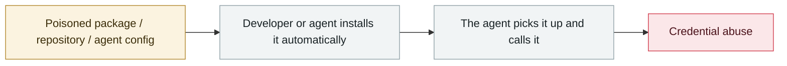

# Backdoored LiteLLM release

      

## Summary

Attack chain: Trivy CI compromised → aqua-bot credentials stolen → trivy-action tampered with → LiteLLM's PyPI token stolen → malicious versions 1.82.7 / 1.82.8 published. **LiteLLM is the model gateway for dozens of agent frameworks including CrewAI, DSPy and Microsoft GraphRAG**. Attribution to **TeamPCP (UNC6780)**, embedding the SANDCLOCK credential stealer

⚠️ **Conflicting download figures: 119,000 within 2.5 hours / 47,000 within 3 hours**

## Attack chain

## Sources

| # | Source | Link |
|---|---|---|
| 1 | GTIG | <https://cloud.google.com/blog/ja/topics/threat-intelligence/ai-vulnerability-exploitation-initial-access> |
| 2 | Theori | <https://theori.io/ko/blog/2026-h1-hot-security-issue-case> |

## Metadata

| Field | Value |
|---|---|
| Date | `2026-03-24` (raw: 2026-03-24, precision `day`) |
| Kind | Incident `incident` |
| Type | [`SUPPLY`](../../taxonomy/types.md#supply) Supply-chain poisoning · [`CRED`](../../taxonomy/types.md#cred) Credential abuse |
| Severity | **Critical** `critical` |
| Confidence | **A** — primary source (vendor / victim / law enforcement / official report) |
| Real harm | Yes |
| AI involvement | Confirmed `confirmed` |
| Region | [Global](../../regions/global.md) |
| Archive ID | `2026-03-24-litellm-backdoored-release` |

**Why this classification:** Real incident with a confirmed victim. Rated `critical`: confirmed real damage at the multi-organization / government / critical-infrastructure / supply-chain-worm level, or a first-of-its-kind capability milestone with real victims. Grading criteria: see [taxonomy/severity.md](../../taxonomy/severity.md) and [taxonomy/confidence.md](../../taxonomy/confidence.md).

## Related

**Topic:** [Agent supply-chain poisoning](../../topics/agent-supply-chain.md)

**Related records:**

- `2026-03-01` [Hades: a sustained campaign turning AI coding assistants into the attack surface](2026-03-01-hades-campaign-ai-coding-assistants.md)   Hades: a sustained campaign turning AI coding assistants into the attack surface
- `2026-03-30` [Axios npm package compromised](2026-03-30-axios-npm-compromised.md)   Axios npm package compromised
- `2026-03-02` [Sustained supply-chain compromise across the Trivy ecosystem](2026-03-02-trivy-sheng-tai-chi-xu.md)   Sustained supply-chain compromise across the Trivy ecosystem
- `2026-03-26` [Anthropic CMS misconfiguration reveals the existence of "Mythos"](2026-03-26-anthropic-cms-mythos.md)   Anthropic CMS misconfiguration reveals the existence of "Mythos"

---

[← 2026-03 index](README.md) · [← All records](../../README.md) · [Chinese](../i18n/zh/2026-03/2026-03-24-litellm-backdoored-release.md)

This record is part of the **Orca AI Incident Archive**, licensed [CC BY 4.0](../../LICENSE). Found a factual error or a missing source? [Open an issue or PR](../../CONTRIBUTING.md) — corrections are recorded in the record's revision history, never silently overwritten.
