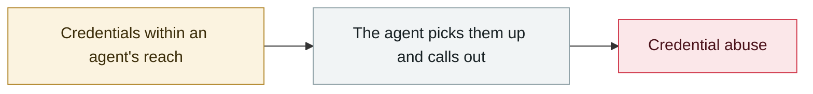

# Anthropic CMS misconfiguration reveals the existence of "Mythos"

     

## Summary

About 3,000 assets exposed through a CMS/data-store misconfiguration, **the first exposure of the unreleased Mythos model** and of its "step change in capabilities" positioning

## Attack chain

## Sources

| # | Source | Link |
|---|---|---|
| 1 | Fortune | <https://fortune.com/2026/03/26/anthropic-says-testing-mythos-powerful-new-ai-model-after-data-leak-reveals-its-existence-step-change-in-capabilities/> |

## Metadata

| Field | Value |
|---|---|
| Date | `2026-03-26` (raw: 2026-03-26, precision `day`) |
| Kind | Incident `incident` |
| Type | [`CRED`](../../taxonomy/types.md#cred) Credential abuse |
| Severity | **High** `high` |
| Confidence | **A** — primary source (vendor / victim / law enforcement / official report) |
| Real harm | Yes |
| AI involvement | Confirmed `confirmed` |
| Region | [Global](../../regions/global.md) |
| Archive ID | `2026-03-26-anthropic-cms-mythos` |

**Why this classification:** Real incident with a confirmed victim. Rated `high`: real damage is limited in scope, or it is a CVSS 9+ severe flaw, or a capability demonstration of significance. Grading criteria: see [taxonomy/severity.md](../../taxonomy/severity.md) and [taxonomy/confidence.md](../../taxonomy/confidence.md).

## Related

**Related records:**

- `2026-03-01` [Hades: a sustained campaign turning AI coding assistants into the attack surface](2026-03-01-hades-campaign-ai-coding-assistants.md)   Hades: a sustained campaign turning AI coding assistants into the attack surface
- `2026-03-24` [Backdoored LiteLLM release](2026-03-24-litellm-backdoored-release.md)   Backdoored LiteLLM release
- `2026-03-31` [Anthropic Claude Code source code leak](2026-03-31-anthropic-claude-code.md)   Anthropic Claude Code source code leak
- `2026-03-01` [METR API key stolen, $600K of credit burned](2026-03-01-metr-api-key.md)   METR API key stolen, $600K of credit burned

---

[← 2026-03 index](README.md) · [← All records](../../README.md) · [Chinese](../i18n/zh/2026-03/2026-03-26-anthropic-cms-mythos.md)

This record is part of the **Orca AI Incident Archive**, licensed [CC BY 4.0](../../LICENSE). Found a factual error or a missing source? [Open an issue or PR](../../CONTRIBUTING.md) — corrections are recorded in the record's revision history, never silently overwritten.
