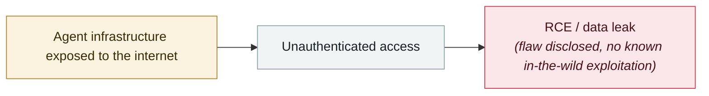

# Langflow path traversal enables arbitrary file write

     

## Summary

Tenable: CVE-2026-5027 (CWE-22), `POST /api/v2/files` does not validate the filename. VulnCheck notes this can lead to RCE, and Langflow **ships with unauthenticated auto-login enabled by default**, with about **7,000** publicly reachable instances and in-the-wild exploitation attempts already observed. Fixed in v1.9.0

## Attack chain

## Sources

| # | Source | Link |
|---|---|---|
| 1 | Tenable | <https://www.tenable.com/security/research/tra-2026-26> |
| 2 | SecurityWeek | <https://www.securityweek.com/hackers-exploit-langflow-vulnerability-for-remote-code-execution/> |

## Metadata

| Field | Value |
|---|---|
| Date | `2026-03-27` (raw: 2026-03-27, precision `day`) |
| Kind | Vulnerability disclosure `vulnerability` |
| Type | [`INFRA`](../../taxonomy/types.md#infra) Agent infrastructure exposure |
| Severity | **High** `high` |
| Confidence | **A** — primary source (vendor / victim / law enforcement / official report) |
| Real harm | No |
| AI involvement | Confirmed `confirmed` |
| Region | [Global](../../regions/global.md) |
| Archive ID | `2026-03-27-langflow-lu-jing-chuan-yue` |

**Why this classification:** Vulnerability disclosure; as of archiving there is no evidence of in-the-wild exploitation, so `real_harm: false`. Rated `high`: real damage is limited in scope, or it is a CVSS 9+ severe flaw, or a capability demonstration of significance. Grading criteria: see [taxonomy/severity.md](../../taxonomy/severity.md) and [taxonomy/confidence.md](../../taxonomy/confidence.md).

## Related

**Topic:** [Agent infrastructure exposure](../../topics/agent-infra.md)

**Related records:**

- `2026-03-09` [McKinsey Lilli incident goes public](2026-03-09-lilli-mai-ken-xi-shi.md)   McKinsey Lilli incident goes public
- `2026-02-28` [CodeWall breaches McKinsey's internal "Lilli" AI platform](../2026-02/2026-02-28-codewall-breaches-mckinsey-lilli.md)   CodeWall breaches McKinsey's internal "Lilli" AI platform
- `2026-04-16` [MCPwn (CVE-2026-33032): nginx-ui MCP endpoint hit in the wild](../2026-04/2026-04-16-mcpwn-nginx-ui-in-the-wild.md)   MCPwn (CVE-2026-33032): nginx-ui MCP endpoint hit in the wild
- `2026-02-10` [15,200 OpenClaw control panels exposed](../2026-02/2026-02-10-openclaw-kong-zhi-mian-ban.md)   15,200 OpenClaw control panels exposed

---

[← 2026-03 index](README.md) · [← All records](../../README.md) · [Chinese](../i18n/zh/2026-03/2026-03-27-langflow-lu-jing-chuan-yue.md)

This record is part of the **Orca AI Incident Archive**, licensed [CC BY 4.0](../../LICENSE). Found a factual error or a missing source? [Open an issue or PR](../../CONTRIBUTING.md) — corrections are recorded in the record's revision history, never silently overwritten.
