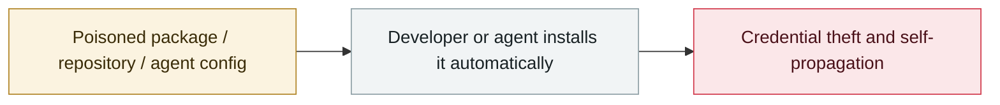

# Axios npm package compromised

     

## Summary

v1.14.1 and 0.30.4 were seeded with a malicious dependency `plain-crypto-js@4.2.1` that drops the cross-platform RAT **WAVESHAPER.V2** via postinstall (separate platform payloads in PowerShell/C++/Python). Attribution to North Korea-linked **UNC1069**. **Deepfakes were used to social-engineer the maintainer during the attack**. The malicious versions were live for about 3 hours; the package gets 100M+ weekly downloads

## Attack chain

## Sources

| # | Source | Link |
|---|---|---|
| 1 | Google Cloud | <https://cloud.google.com/blog/topics/threat-intelligence/north-korea-threat-actor-targets-axios-npm-package/?hl=en> |
| 2 | Elastic | <https://www.elastic.co/security-labs/axios-one-rat-to-rule-them-all> |
| 3 | axios#10636 | <https://github.com/axios/axios/issues/10636> |

## Metadata

| Field | Value |
|---|---|
| Date | `2026-03-30` (raw: 2026-03-30, precision `day`) |
| Kind | Incident `incident` |
| Type | [`SUPPLY`](../../taxonomy/types.md#supply) Supply-chain poisoning |
| Severity | **Critical** `critical` |
| Confidence | **A** — primary source (vendor / victim / law enforcement / official report) |
| Real harm | Yes |
| AI involvement | Confirmed `confirmed` |
| Region | [Global](../../regions/global.md) |
| Archive ID | `2026-03-30-axios-npm-compromised` |

**Why this classification:** Real incident with a confirmed victim. Rated `critical`: confirmed real damage at the multi-organization / government / critical-infrastructure / supply-chain-worm level, or a first-of-its-kind capability milestone with real victims. Grading criteria: see [taxonomy/severity.md](../../taxonomy/severity.md) and [taxonomy/confidence.md](../../taxonomy/confidence.md).

## Related

**Topic:** [Agent supply-chain poisoning](../../topics/agent-supply-chain.md)

**Related records:**

- `2026-03-01` [Hades: a sustained campaign turning AI coding assistants into the attack surface](2026-03-01-hades-campaign-ai-coding-assistants.md)   Hades: a sustained campaign turning AI coding assistants into the attack surface
- `2026-03-24` [Backdoored LiteLLM release](2026-03-24-litellm-backdoored-release.md)   Backdoored LiteLLM release
- `2026-03-02` [Sustained supply-chain compromise across the Trivy ecosystem](2026-03-02-trivy-sheng-tai-chi-xu.md)   Sustained supply-chain compromise across the Trivy ecosystem
- `2026-02-09` [Clinejection](../2026-02/2026-02-09-clinejection.md)   Clinejection

---

[← 2026-03 index](README.md) · [← All records](../../README.md) · [Chinese](../i18n/zh/2026-03/2026-03-30-axios-npm-compromised.md)

This record is part of the **Orca AI Incident Archive**, licensed [CC BY 4.0](../../LICENSE). Found a factual error or a missing source? [Open an issue or PR](../../CONTRIBUTING.md) — corrections are recorded in the record's revision history, never silently overwritten.
