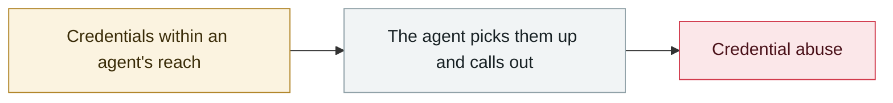

# Anthropic Claude Code source code leak

     

## Summary

An npm package accidentally included a source map (.map), leaking about **510,000 lines of TypeScript / 1,906 files / 59.8 MB** and exposing unreleased features such as the KAIROS autonomous agent mode. AI-built clones appeared within a day, along with a "leaked source" version laced with the **Vidar infostealer** and the **GhostSocks proxy**

## Attack chain

## Sources

| # | Source | Link |
|---|---|---|
| 1 | The Register | <https://www.theregister.com/software/2026/03/31/anthropic-accidentally-exposes-claude-code-source-code/5227940> |
| 2 | CNBC | <https://www.cnbc.com/2026/03/31/anthropic-leak-claude-code-internal-source.html> |
| 3 | Zscaler | <https://www.zscaler.com/blogs/security-research/anthropic-claude-code-leak> |

## Metadata

| Field | Value |
|---|---|
| Date | `2026-03-31` (raw: 2026-03-31, precision `day`) |
| Kind | Incident `incident` |
| Type | [`CRED`](../../taxonomy/types.md#cred) Credential abuse |
| Severity | **High** `high` |
| Confidence | **A** — primary source (vendor / victim / law enforcement / official report) |
| Real harm | Yes |
| AI involvement | Confirmed `confirmed` |
| Region | [Global](../../regions/global.md) |
| Archive ID | `2026-03-31-anthropic-claude-code` |

**Why this classification:** Real incident with a confirmed victim. Rated `high`: real damage is limited in scope, or it is a CVSS 9+ severe flaw, or a capability demonstration of significance. Grading criteria: see [taxonomy/severity.md](../../taxonomy/severity.md) and [taxonomy/confidence.md](../../taxonomy/confidence.md).

## Related

**Related records:**

- `2026-03-01` [Hades: a sustained campaign turning AI coding assistants into the attack surface](2026-03-01-hades-campaign-ai-coding-assistants.md)   Hades: a sustained campaign turning AI coding assistants into the attack surface
- `2026-03-24` [Backdoored LiteLLM release](2026-03-24-litellm-backdoored-release.md)   Backdoored LiteLLM release
- `2026-03-26` [Anthropic CMS misconfiguration reveals the existence of "Mythos"](2026-03-26-anthropic-cms-mythos.md)   Anthropic CMS misconfiguration reveals the existence of "Mythos"
- `2026-03-01` [METR API key stolen, $600K of credit burned](2026-03-01-metr-api-key.md)   METR API key stolen, $600K of credit burned

---

[← 2026-03 index](README.md) · [← All records](../../README.md) · [Chinese](../i18n/zh/2026-03/2026-03-31-anthropic-claude-code.md)

This record is part of the **Orca AI Incident Archive**, licensed [CC BY 4.0](../../LICENSE). Found a factual error or a missing source? [Open an issue or PR](../../CONTRIBUTING.md) — corrections are recorded in the record's revision history, never silently overwritten.
