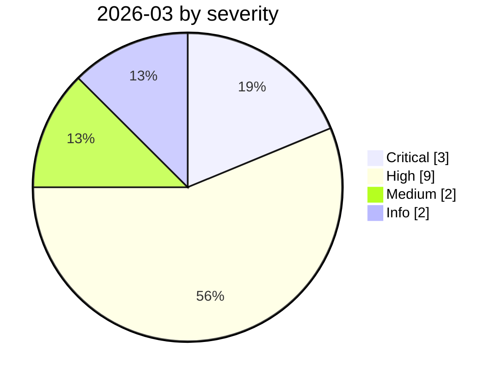

# 2026-03

<!-- BEGIN:summary -->
**16** records

    

## Records this month

| Date | Record | Type | Severity | Confidence | Real harm |
|---|---|---|---|---|---|
| `03-01` | ★ [Hades: a sustained campaign turning AI coding assistants into the attack surface](2026-03-01-hades-campaign-ai-coding-assistants.md) | `SUPPLY` `CRED` | **Critical** | A | ✅ |
| `03-01` | [Claudy Day: a three-flaw chain in claude.ai](2026-03-01-claudy-day-claude-ai.md) | `IPI` `EXFIL` | **High** | A | — |
| `03-01` | [METR API key stolen, $600K of credit burned](2026-03-01-metr-api-key.md) | `CRED` | **High** | A | ✅ |
| `03-02` | [Amazon hit by back-to-back outages from AI-generated code](2026-03-02-amazon-yin-sheng-cheng-dai.md) ⚠️ | `ROGUE` | **High** | B | ✅ |
| `03-02` | [Sustained supply-chain compromise across the Trivy ecosystem](2026-03-02-trivy-sheng-tai-chi-xu.md) | `SUPPLY` | **High** | A | ✅ |
| `03-06` | [Microsoft, "AI as tradecraft"](2026-03-06-microsoft-as-tradecraft.md) | `WEAPON` | Info | A | · |
| `03-09` | [McKinsey Lilli incident goes public](2026-03-09-lilli-mai-ken-xi-shi.md) | `INFRA` | **High** | A | — |
| `03-10` | [Azure MCP Server SSRF privilege escalation (CVE-2026-26118)](2026-03-10-azure-mcp-server-ssrf.md) | `MCP` | Medium | A | — |
| `03-16` | [CellShock: data exfiltration through an AI spreadsheet tool](2026-03-16-cellshock-biao-ge-gong-ju.md) | `IPI` `EXFIL` | Medium | A | — |
| `03-18` | [Meta internal AI agent data exposure](2026-03-18-meta-agent-nei-bu-shu.md) | `ROGUE` | **High** | B | ✅ |
| `03-18` | [Rome court annuls the Garante's €15M fine against OpenAI](2026-03-18-garante-yi-li-luo-ma.md) | `GOV` | Info | A | · |
| `03-24` | ★ [Backdoored LiteLLM release](2026-03-24-litellm-backdoored-release.md) | `SUPPLY` `CRED` | **Critical** | A | ✅ |
| `03-26` | [Anthropic CMS misconfiguration reveals the existence of "Mythos"](2026-03-26-anthropic-cms-mythos.md) | `CRED` | **High** | A | ✅ |
| `03-27` | [Langflow path traversal enables arbitrary file write](2026-03-27-langflow-lu-jing-chuan-yue.md) | `INFRA` | **High** | A | — |
| `03-30` | ★ [Axios npm package compromised](2026-03-30-axios-npm-compromised.md) | `SUPPLY` | **Critical** | A | ✅ |
| `03-31` | [Anthropic Claude Code source code leak](2026-03-31-anthropic-claude-code.md) | `CRED` | **High** | A | ✅ |

★ = `critical` · ⚠️ = disputed facts or attribution · real harm: ✅ confirmed victim / — none / · not applicable (policy and intelligence reports)
<!-- END:summary -->

<!-- BEGIN:nav -->
---

[← 2026-02](../2026-02/README.md) · [Archive index](../../README.md) · [By type](../../taxonomy/types.md) · [2026-04 →](../2026-04/README.md)
<!-- END:nav -->
