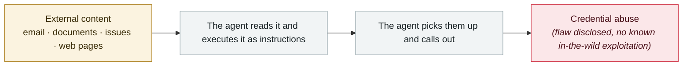

# Three CVEs in the Claude Code GitHub Action: a PR title steals your API key

      

## Summary

**CVE-2026-35020 / 35021 / 35022, CVSS 9.4**. A carefully crafted PR title alone can prompt-inject the Claude Code agent running in GitHub Actions and exfiltrate `ANTHROPIC_API_KEY` to an attacker endpoint. **No authentication and no repository permissions needed — opening a PR is enough**. Confirmed exfiltratable: `ANTHROPIC_API_KEY`, `GITHUB_TOKEN`, `GEMINI_API_KEY`, `GITHUB_COPILOT_API_TOKEN`, `GITHUB_PERSONAL_ACCESS_TOKEN`. **The same injection vector reproduced successfully on Claude Code, Gemini CLI and GitHub Copilot Agent**. Anthropic fixed it in **Claude Code 2.1.128 on 2026-05-05** with five layers of control (tool-scope allowlist, read-only GITHUB_TOKEN, OIDC secret routing, actor filtering, script loop cap)

## Attack chain

## Sources

| # | Source | Link |
|---|---|---|
| 1 | CSA | <https://labs.cloudsecurityalliance.org/research/csa-research-note-claude-code-github-action-prompt-injection/> |
| 2 | reproduction analysis | <https://oddguan.com/blog/comment-and-control-prompt-injection-credential-theft-claude-code-gemini-cli-github-copilot/> |

## Metadata

| Field | Value |
|---|---|
| Date | `2026-04-01` (raw: 2026-04, precision `month`) |
| Kind | Vulnerability disclosure `vulnerability` |
| Type | [`IPI`](../../taxonomy/types.md#ipi) Indirect prompt injection · [`CRED`](../../taxonomy/types.md#cred) Credential abuse |
| Severity | **High** `high` |
| Confidence | **A** — primary source (vendor / victim / law enforcement / official report) |
| Real harm | No |
| AI involvement | Confirmed `confirmed` |
| Region | [Global](../../regions/global.md) |
| Archive ID | `2026-04-01-claude-code-github-action` |

**Why this classification:** Vulnerability disclosure; as of archiving there is no evidence of in-the-wild exploitation, so `real_harm: false`. Rated `high`: real damage is limited in scope, or it is a CVSS 9+ severe flaw, or a capability demonstration of significance. Grading criteria: see [taxonomy/severity.md](../../taxonomy/severity.md) and [taxonomy/confidence.md](../../taxonomy/confidence.md).

## Related

**Topic:** [Zero-click data exfiltration chain](../../topics/zero-click-exfil.md)

**Related records:**

- `2026-04-15` [ShareLeak (CVE-2026-21520) and PipeLeak](2026-04-15-shareleak-pipeleak.md)   ShareLeak (CVE-2026-21520) and PipeLeak
- `2026-04-19` [Vercel OAuth supply-chain intrusion](2026-04-19-vercel-oauth-gong-ying-lian.md)   Vercel OAuth supply-chain intrusion
- `2026-04-21` [Unauthorised access to Anthropic's "Mythos"](2026-04-21-anthropic-mythos-zao-shou-quan.md)   Unauthorised access to Anthropic's "Mythos"
- `2026-04-30` [Apple Support app ships an internal CLAUDE.md by mistake](2026-04-30-apple-support-app-claude-md.md)   Apple Support app ships an internal CLAUDE.md by mistake

---

[← 2026-04 index](README.md) · [← All records](../../README.md) · [Chinese](../i18n/zh/2026-04/2026-04-01-claude-code-github-action.md)

This record is part of the **Orca AI Incident Archive**, licensed [CC BY 4.0](../../LICENSE). Found a factual error or a missing source? [Open an issue or PR](../../CONTRIBUTING.md) — corrections are recorded in the record's revision history, never silently overwritten.
