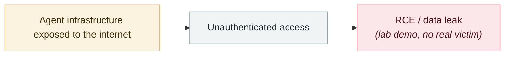

# Google Vertex AI "Double Agent" permission abuse

     

## Summary

Unit 42: an over-privileged service agent can reach producer project resources, internal artifacts and consumer data

## Attack chain

## Sources

| # | Source | Link |
|---|---|---|
| 1 | OWASP Q1'26 | <https://genai.owasp.org/2026/04/14/owasp-genai-exploit-round-up-report-q1-2026/> |

## Metadata

| Field | Value |
|---|---|
| Date | `2026-04-01` (raw: 2026-04-01, precision `day`) |
| Kind | Research demo `research` |
| Type | [`INFRA`](../../taxonomy/types.md#infra) Agent infrastructure exposure |
| Severity | **Medium** `medium` |
| Confidence | **A** — primary source (vendor / victim / law enforcement / official report) |
| Real harm | No |
| AI involvement | Confirmed `confirmed` |
| Region | [Global](../../regions/global.md) |
| Archive ID | `2026-04-01-google-vertex-double-agent` |

**Why this classification:** Controlled demo by a research lab or vendor, `real_harm: false`; the record marks when the attack surface became public. Rated `medium`: controlled demo, moderate flaw, or an incident limited to a single user / single machine. Grading criteria: see [taxonomy/severity.md](../../taxonomy/severity.md) and [taxonomy/confidence.md](../../taxonomy/confidence.md).

## Related

**Topic:** [Agent infrastructure exposure](../../topics/agent-infra.md)

**Related records:**

- `2026-04-16` [MCPwn (CVE-2026-33032): nginx-ui MCP endpoint hit in the wild](2026-04-16-mcpwn-nginx-ui-in-the-wild.md)   MCPwn (CVE-2026-33032): nginx-ui MCP endpoint hit in the wild
- `2026-04-07` [Flowise CVE-2025-59528 exploited in the wild](2026-04-07-flowise-ye-li-yong.md)   Flowise CVE-2025-59528 exploited in the wild
- `2026-04-23` [OpenClaw "Claw Chain": four chained flaws, 245,000 servers exposed](2026-04-23-openclaw-claw-chain.md)   OpenClaw "Claw Chain": four chained flaws, 245,000 servers exposed
- `2026-04-06` [OpenClaw's CVE rate: 2.2 per day](2026-04-06-openclaw-chan-chu-su-lv.md)   OpenClaw's CVE rate: 2.2 per day

---

[← 2026-04 index](README.md) · [← All records](../../README.md) · [Chinese](../i18n/zh/2026-04/2026-04-01-google-vertex-double-agent.md)

This record is part of the **Orca AI Incident Archive**, licensed [CC BY 4.0](../../LICENSE). Found a factual error or a missing source? [Open an issue or PR](../../CONTRIBUTING.md) — corrections are recorded in the record's revision history, never silently overwritten.
