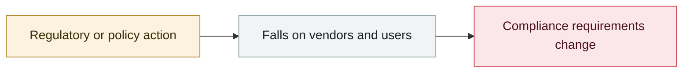

# OpenClaw's CVE rate: 2.2 per day

     

## Summary

As of 2026-04-06 OpenClaw had accumulated **138 CVEs**, all inside a single **63-day** window — about **2.2 per day**, of which **7 critical and 49 high**. The most severe, **CVE-2026-22172** and **CVE-2026-32922**, are both **CVSS 9.9** (unauthenticated administrative control and privilege escalation respectively). Also: **the first formal audit on 2026-01-25 alone found 512 vulnerabilities, 8 of them critical**

💡 The rate itself is a data point: **a component that produced 138 CVEs in two months is being installed on developer machines as a personal AI assistant**

## Attack chain

## Sources

| # | Source | Link |
|---|---|---|
| 1 | CVE roundup | <https://www.betterclaw.io/blog/openclaw-security-2026> |
| 2 | ARMO(CVE-2026-32922) | <https://www.armosec.io/blog/cve-2026-32922-openclaw-privilege-escalation-cloud-security/> |

## Metadata

| Field | Value |
|---|---|
| Date | `2026-04-06` (raw: 2026-04-06, precision `day`) |
| Kind | Policy & regulation `policy` |
| Type | [`INFRA`](../../taxonomy/types.md#infra) Agent infrastructure exposure |
| Severity | **Info** `info` |
| Confidence | **B** — research lab or major outlet with checkable detail |
| Real harm | n/a |
| AI involvement | Confirmed `confirmed` |
| Region | [Global](../../regions/global.md) |
| Archive ID | `2026-04-06-openclaw-chan-chu-su-lv` |

**Why this classification:** Policy / regulatory action, not counted in incident statistics; `severity` is recorded as `info`. Grading criteria: see [taxonomy/severity.md](../../taxonomy/severity.md) and [taxonomy/confidence.md](../../taxonomy/confidence.md).

## Related

**Topic:** [Agent infrastructure exposure](../../topics/agent-infra.md)

**Related records:**

- `2026-04-16` [MCPwn (CVE-2026-33032): nginx-ui MCP endpoint hit in the wild](2026-04-16-mcpwn-nginx-ui-in-the-wild.md)   MCPwn (CVE-2026-33032): nginx-ui MCP endpoint hit in the wild
- `2026-04-07` [Flowise CVE-2025-59528 exploited in the wild](2026-04-07-flowise-ye-li-yong.md)   Flowise CVE-2025-59528 exploited in the wild
- `2026-04-23` [OpenClaw "Claw Chain": four chained flaws, 245,000 servers exposed](2026-04-23-openclaw-claw-chain.md)   OpenClaw "Claw Chain": four chained flaws, 245,000 servers exposed
- `2026-04-01` [Google Vertex AI "Double Agent" permission abuse](2026-04-01-google-vertex-double-agent.md)   Google Vertex AI "Double Agent" permission abuse

---

[← 2026-04 index](README.md) · [← All records](../../README.md) · [Chinese](../i18n/zh/2026-04/2026-04-06-openclaw-chan-chu-su-lv.md)

This record is part of the **Orca AI Incident Archive**, licensed [CC BY 4.0](../../LICENSE). Found a factual error or a missing source? [Open an issue or PR](../../CONTRIBUTING.md) — corrections are recorded in the record's revision history, never silently overwritten.
