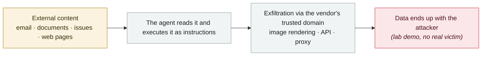

# GrafanaGhost indirect prompt injection

      

## Summary

Noma Security: exfiltrating telemetry, infrastructure, customer and financial data via a URL parameter

## Attack chain

## Sources

| # | Source | Link |
|---|---|---|
| 1 | OWASP Q1'26 | <https://genai.owasp.org/2026/04/14/owasp-genai-exploit-round-up-report-q1-2026/> |

## Metadata

| Field | Value |
|---|---|
| Date | `2026-04-07` (raw: 2026-04-07, precision `day`) |
| Kind | Research demo `research` |
| Type | [`IPI`](../../taxonomy/types.md#ipi) Indirect prompt injection · [`EXFIL`](../../taxonomy/types.md#exfil) Data exfiltration |
| Severity | **Medium** `medium` |
| Confidence | **A** — primary source (vendor / victim / law enforcement / official report) |
| Real harm | No |
| AI involvement | Confirmed `confirmed` |
| Region | [Global](../../regions/global.md) |
| Archive ID | `2026-04-07-grafanaghost-jian-jie-ti-shi` |

**Why this classification:** Controlled demo by a research lab or vendor, `real_harm: false`; the record marks when the attack surface became public. Rated `medium`: controlled demo, moderate flaw, or an incident limited to a single user / single machine. Grading criteria: see [taxonomy/severity.md](../../taxonomy/severity.md) and [taxonomy/confidence.md](../../taxonomy/confidence.md).

## Related

**Topic:** [Zero-click data exfiltration chain](../../topics/zero-click-exfil.md)

**Related records:**

- `2026-04-01` [Three CVEs in the Claude Code GitHub Action: a PR title steals your API key](2026-04-01-claude-code-github-action.md)   Three CVEs in the Claude Code GitHub Action: a PR title steals your API key
- `2026-04-15` [ShareLeak (CVE-2026-21520) and PipeLeak](2026-04-15-shareleak-pipeleak.md)   ShareLeak (CVE-2026-21520) and PipeLeak
- `2026-04-17` [Meta AI support bot tricked into handing over an Instagram account](2026-04-17-meta-instagram-ke-fu-ji.md)   Meta AI support bot tricked into handing over an Instagram account
- `2026-03-01` [Claudy Day: a three-flaw chain in claude.ai](../2026-03/2026-03-01-claudy-day-claude-ai.md)   Claudy Day: a three-flaw chain in claude.ai

---

[← 2026-04 index](README.md) · [← All records](../../README.md) · [Chinese](../i18n/zh/2026-04/2026-04-07-grafanaghost-jian-jie-ti-shi.md)

This record is part of the **Orca AI Incident Archive**, licensed [CC BY 4.0](../../LICENSE). Found a factual error or a missing source? [Open an issue or PR](../../CONTRIBUTING.md) — corrections are recorded in the record's revision history, never silently overwritten.
