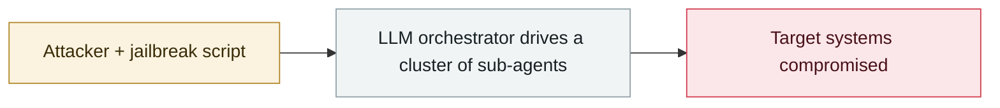

# Aurora ransomware operators use Cursor Agent in live intrusions

     

## Summary

A Russian-speaking crime group (identified through exposed infrastructure) **ran Claude Sonnet inside Cursor Agent** to assist attacks on **10 victims**: environment reconnaissance scans, installing a VPN client, running certificate attacks and hitting ESXi. Made public in 2026-08

## Attack chain

## Sources

| # | Source | Link |
|---|---|---|
| 1 | THN | <https://thehackernews.com/2026/08/aurora-ransomware-operators-use-cursor.html> |
| 2 | Infosecurity | <https://www.infosecurity-magazine.com/news/abuse-cursor-agent-ransomware/> |
| 3 | CSA | <https://labs.cloudsecurityalliance.org/research/csa-research-note-aurora-ransomware-cursor-ai-abuse-20260901/> |

## Metadata

| Field | Value |
|---|---|
| Date | `2026-04-08` → `2026-05-26` (raw: 2026-04-08→05-26, precision `day`) |
| Kind | Incident `incident` |
| Type | [`WEAPON`](../../taxonomy/types.md#weapon) Agent used as a weapon |
| Severity | **High** `high` |
| Confidence | **A** — primary source (vendor / victim / law enforcement / official report) |
| Real harm | Yes |
| AI involvement | Confirmed `confirmed` |
| Region | [Global](../../regions/global.md) |
| Archive ID | `2026-04-08-aurora-cursor-agent` |

**Why this classification:** Real incident with a confirmed victim. Rated `high`: real damage is limited in scope, or it is a CVSS 9+ severe flaw, or a capability demonstration of significance. Grading criteria: see [taxonomy/severity.md](../../taxonomy/severity.md) and [taxonomy/confidence.md](../../taxonomy/confidence.md).

## Related

**Topic:** [Offensive AI capability evolution](../../topics/offensive-ai.md)

**Related records:**

- `2026-05-10` [First in-the-wild LLM agent running the full post-exploitation chain](../2026-05/2026-05-10-first-in-wild-autonomous-llm-post-exploitation.md)   First in-the-wild LLM agent running the full post-exploitation chain
- `2026-03-06` [Microsoft, "AI as tradecraft"](../2026-03/2026-03-06-microsoft-as-tradecraft.md)   Microsoft, "AI as tradecraft"
- `2026-05-12` [GTIG AI threat tracker, 2026 edition](../2026-05/2026-05-12-gtig-wei-xie-zhui-zong.md)   GTIG AI threat tracker, 2026 edition
- `2026-02-20` [AI-augmented actor compromises 600+ FortiGate devices](../2026-02/2026-02-20-fortigate-600-devices-compromised.md)   AI-augmented actor compromises 600+ FortiGate devices

---

[← 2026-04 index](README.md) · [← All records](../../README.md) · [Chinese](../i18n/zh/2026-04/2026-04-08-aurora-cursor-agent.md)

This record is part of the **Orca AI Incident Archive**, licensed [CC BY 4.0](../../LICENSE). Found a factual error or a missing source? [Open an issue or PR](../../CONTRIBUTING.md) — corrections are recorded in the record's revision history, never silently overwritten.
