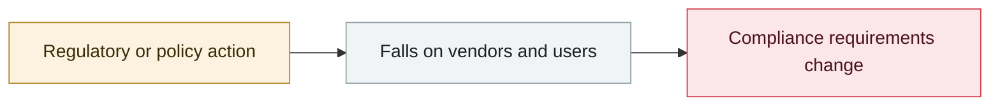

# UK AISI independently evaluates Claude Mythos Preview

     

## Summary

Conclusion: **without defenses in place, Mythos's attack success rate is not particularly high**

## Attack chain

## Sources

| # | Source | Link |
|---|---|---|
| 1 | UK AISI | <https://www.aisi.gov.uk/blog/our-evaluation-of-claude-mythos-previews-cyber-capabilities> |

## Metadata

| Field | Value |
|---|---|
| Date | `2026-04-13` (raw: 2026-04-13, precision `day`) |
| Kind | Policy & regulation `policy` |
| Type | [`GOV`](../../taxonomy/types.md#gov) Governance & policy |
| Severity | **Info** `info` |
| Confidence | **A** — primary source (vendor / victim / law enforcement / official report) |
| Real harm | n/a |
| AI involvement | Confirmed `confirmed` |
| Region | [United Kingdom](../../regions/uk.md) |
| Archive ID | `2026-04-13-uk-aisi-claude-mythos` |

**Why this classification:** Policy / regulatory action, not counted in incident statistics; `severity` is recorded as `info`. Grading criteria: see [taxonomy/severity.md](../../taxonomy/severity.md) and [taxonomy/confidence.md](../../taxonomy/confidence.md).

## Related

**Topic:** [Defense & governance](../../topics/defense.md)

**Related records:**

- `2026-04-07` [Claude Mythos Preview cyber capability disclosure, Project Glasswing formed](2026-04-07-claude-mythos-preview-project.md)   Claude Mythos Preview cyber capability disclosure, Project Glasswing formed
- `2026-04-14` [Vidoc reproduces Mythos's findings with public models](2026-04-14-vidoc-mythos-yong-gong-kai.md)   Vidoc reproduces Mythos's findings with public models
- `2026-04-30` [OpenAI launches Advanced Account Security](2026-04-30-tui-chu-gao-ji-zhang.md)   OpenAI launches Advanced Account Security
- `2026-05-12` [Brazilian labour court sanctions lawyers over prompt injection](../2026-05/2026-05-12-brazil-labor-court-prompt-injection-sanction.md)   Brazilian labour court sanctions lawyers over prompt injection

---

[← 2026-04 index](README.md) · [← All records](../../README.md) · [Chinese](../i18n/zh/2026-04/2026-04-13-uk-aisi-claude-mythos.md)

This record is part of the **Orca AI Incident Archive**, licensed [CC BY 4.0](../../LICENSE). Found a factual error or a missing source? [Open an issue or PR](../../CONTRIBUTING.md) — corrections are recorded in the record's revision history, never silently overwritten.
