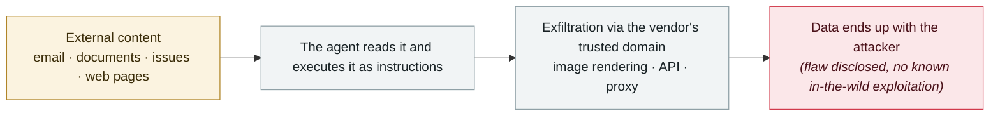

# ShareLeak (CVE-2026-21520) and PipeLeak

      

> [!WARNING]
> **This record contains disputed or not fully verified facts**; the accounts of the parties are kept side by side in the body — do not quote one side alone.

## Summary

Found by **Capsule Security** (**v1 mistakenly recorded this as Zenity and placed it in 2026-08**). ShareLeak: Copilot Studio concatenated SharePoint form submissions with the agent's system instructions **without any sanitisation**, so an injected fake system-role message directed the agent to query connected SharePoint lists for PII/leads/CRM data and send it through Outlook to a chosen address. CVSS 7.5, **patch deployed 2026-01-15**. PipeLeak: the same class of problem in Salesforce Agentforce, where **Salesforce assigned no CVE and issued no advisory**. VentureBeat notes: **even when security mechanisms flagged the attack, the data was still taken**

## Attack chain

## Sources

| # | Source | Link |
|---|---|---|
| 1 | VentureBeat | <https://venturebeat.com/security/microsoft-salesforce-copilot-agentforce-prompt-injection-cve-agent-remediation-playbook> |
| 2 | Capsule Security | <https://www.capsulesecurity.io/blog-post/shareleak-taking-the-wheel-of-microsofts-copilot-studio-cve-2026-21520> |
| 3 | Dark Reading | <https://www.darkreading.com/cloud-security/microsoft-salesforce-patch-ai-agent-data-leak-flaws> |

## Metadata

| Field | Value |
|---|---|
| Date | `2026-04-15` (raw: 2026-04-15, precision `day`) |
| Kind | Vulnerability disclosure `vulnerability` |
| Type | [`IPI`](../../taxonomy/types.md#ipi) Indirect prompt injection · [`EXFIL`](../../taxonomy/types.md#exfil) Data exfiltration |
| Severity | **High** `high` |
| Confidence | **A** — primary source (vendor / victim / law enforcement / official report) |
| Real harm | No |
| AI involvement | Confirmed `confirmed` |
| Region | [Global](../../regions/global.md) |
| Archive ID | `2026-04-15-shareleak-pipeleak` |

**Why this classification:** Vulnerability disclosure; as of archiving there is no evidence of in-the-wild exploitation, so `real_harm: false`. Rated `high`: real damage is limited in scope, or it is a CVSS 9+ severe flaw, or a capability demonstration of significance. Grading criteria: see [taxonomy/severity.md](../../taxonomy/severity.md) and [taxonomy/confidence.md](../../taxonomy/confidence.md).

## Related

**Topic:** [Zero-click data exfiltration chain](../../topics/zero-click-exfil.md)

**Related records:**

- `2026-04-01` [Three CVEs in the Claude Code GitHub Action: a PR title steals your API key](2026-04-01-claude-code-github-action.md)   Three CVEs in the Claude Code GitHub Action: a PR title steals your API key
- `2026-04-17` [Meta AI support bot tricked into handing over an Instagram account](2026-04-17-meta-instagram-ke-fu-ji.md)   Meta AI support bot tricked into handing over an Instagram account
- `2026-04-07` [GrafanaGhost indirect prompt injection](2026-04-07-grafanaghost-jian-jie-ti-shi.md)   GrafanaGhost indirect prompt injection
- `2026-03-01` [Claudy Day: a three-flaw chain in claude.ai](../2026-03/2026-03-01-claudy-day-claude-ai.md)   Claudy Day: a three-flaw chain in claude.ai

---

[← 2026-04 index](README.md) · [← All records](../../README.md) · [Chinese](../i18n/zh/2026-04/2026-04-15-shareleak-pipeleak.md)

This record is part of the **Orca AI Incident Archive**, licensed [CC BY 4.0](../../LICENSE). Found a factual error or a missing source? [Open an issue or PR](../../CONTRIBUTING.md) — corrections are recorded in the record's revision history, never silently overwritten.
