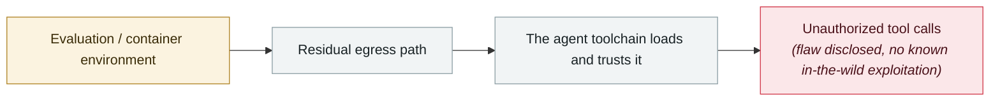

# Windsurf zero-click MCP RCE (CVE-2026-30615)

      

## Summary

Windsurf 1.9544.26: a prompt injection in malicious HTML content can, **with no user interaction at all** (simply opening the attacker's content in the IDE), modify the local MCP configuration and **auto-register a malicious MCP STDIO server**, leading to command execution. Delivery surfaces include web pages browsed in the IDE, a malicious README in a cloned repository, **or a poisoned tool description returned by a remote server**

## Attack chain

## Sources

| # | Source | Link |
|---|---|---|
| 1 | GHSA | <https://github.com/advisories/GHSA-wj2m-jvpr-64cq> |
| 2 | NVD | <https://nvd.nist.gov/vuln/detail/CVE-2026-30615> |

## Metadata

| Field | Value |
|---|---|
| Date | `2026-04-15` (raw: 2026-04-15, precision `day`) |
| Kind | Vulnerability disclosure `vulnerability` |
| Type | [`SANDBOX`](../../taxonomy/types.md#sandbox) Sandbox escape · [`MCP`](../../taxonomy/types.md#mcp) MCP & tool-chain |
| Severity | **High** `high` |
| Confidence | **A** — primary source (vendor / victim / law enforcement / official report) |
| Real harm | No |
| AI involvement | Confirmed `confirmed` |
| Region | [Global](../../regions/global.md) |
| Archive ID | `2026-04-15-windsurf-mcp-rce` |

**Why this classification:** Vulnerability disclosure; as of archiving there is no evidence of in-the-wild exploitation, so `real_harm: false`. Rated `high`: real damage is limited in scope, or it is a CVSS 9+ severe flaw, or a capability demonstration of significance. Grading criteria: see [taxonomy/severity.md](../../taxonomy/severity.md) and [taxonomy/confidence.md](../../taxonomy/confidence.md).

## Related

**Topic:** [Frontier model autonomous overreach](../../topics/eval-escapes.md) · [Agent supply-chain poisoning](../../topics/agent-supply-chain.md)

**Related records:**

- `2026-04-16` [MCPwn (CVE-2026-33032): nginx-ui MCP endpoint hit in the wild](2026-04-16-mcpwn-nginx-ui-in-the-wild.md)   MCPwn (CVE-2026-33032): nginx-ui MCP endpoint hit in the wild
- `2026-04-24` [Gemini CLI CVSS 10.0: one pull request compromises CI](2026-04-24-gemini-cli-pr-ci.md)   Gemini CLI CVSS 10.0: one pull request compromises CI
- `2026-04-28` [OpenAI Codex sandbox-escape zero-day](2026-04-28-codex-sha-xiang-rao-guo.md)   OpenAI Codex sandbox-escape zero-day
- `2026-05-08` [Cline Kanban cross-origin WebSocket hijack (CVE-2026-44211)](../2026-05/2026-05-08-cline-kanban-websocket.md)   Cline Kanban cross-origin WebSocket hijack (CVE-2026-44211)

---

[← 2026-04 index](README.md) · [← All records](../../README.md) · [Chinese](../i18n/zh/2026-04/2026-04-15-windsurf-mcp-rce.md)

This record is part of the **Orca AI Incident Archive**, licensed [CC BY 4.0](../../LICENSE). Found a factual error or a missing source? [Open an issue or PR](../../CONTRIBUTING.md) — corrections are recorded in the record's revision history, never silently overwritten.
