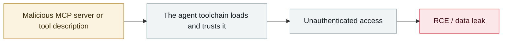

# MCPwn (CVE-2026-33032): nginx-ui MCP endpoint hit in the wild

      

## Summary

**CVSS 9.8, exploited in the wild**, named by Pluto Security. The root cause is strikingly plain: nginx-ui's MCP integration exposes two endpoints; `/mcp` gets both an IP allowlist and authentication enforced by middleware, while **`/mcp_message` applies only the IP allowlist — and that allowlist is empty by default, so the middleware let every connection through**. An unauthenticated remote attacker can thus take full control of the managed Nginx server. About **2,600–2,700** instances are reachable from the cloud, and a PoC was published after disclosure

## Attack chain

## Sources

| # | Source | Link |
|---|---|---|
| 1 | THN | <https://thehackernews.com/2026/04/critical-nginx-ui-vulnerability-cve.html> |
| 2 | eSentire | <https://www.esentire.com/security-advisories/nginx-ui-authentication-bypass-vulnerability-cve-2026-33032-exploited> |
| 3 | Picus | <https://www.picussecurity.com/resource/blog/cve-2026-33032-mcpwn-how-a-missing-middleware-call-in-nginx-ui-hands-attackers-full-web-server-takeover> |

## Metadata

| Field | Value |
|---|---|
| Date | `2026-04-16` (raw: 2026-04-16, precision `day`) |
| Kind | Incident `incident` |
| Type | [`MCP`](../../taxonomy/types.md#mcp) MCP & tool-chain · [`INFRA`](../../taxonomy/types.md#infra) Agent infrastructure exposure |
| Severity | **Critical** `critical` |
| Confidence | **A** — primary source (vendor / victim / law enforcement / official report) |
| Real harm | Yes |
| AI involvement | Confirmed `confirmed` |
| Region | [Global](../../regions/global.md) |
| Archive ID | `2026-04-16-mcpwn-nginx-ui-in-the-wild` |

**Why this classification:** Real incident with a confirmed victim. Rated `critical`: confirmed real damage at the multi-organization / government / critical-infrastructure / supply-chain-worm level, or a first-of-its-kind capability milestone with real victims. Grading criteria: see [taxonomy/severity.md](../../taxonomy/severity.md) and [taxonomy/confidence.md](../../taxonomy/confidence.md).

## Related

**Topic:** [Agent supply-chain poisoning](../../topics/agent-supply-chain.md) · [Agent infrastructure exposure](../../topics/agent-infra.md)

**Related records:**

- `2026-04-07` [Flowise CVE-2025-59528 exploited in the wild](2026-04-07-flowise-ye-li-yong.md)   Flowise CVE-2025-59528 exploited in the wild
- `2026-04-15` [Windsurf zero-click MCP RCE (CVE-2026-30615)](2026-04-15-windsurf-mcp-rce.md)   Windsurf zero-click MCP RCE (CVE-2026-30615)
- `2026-04-23` [OpenClaw "Claw Chain": four chained flaws, 245,000 servers exposed](2026-04-23-openclaw-claw-chain.md)   OpenClaw "Claw Chain": four chained flaws, 245,000 servers exposed
- `2026-04-01` [Google Vertex AI "Double Agent" permission abuse](2026-04-01-google-vertex-double-agent.md)   Google Vertex AI "Double Agent" permission abuse

---

[← 2026-04 index](README.md) · [← All records](../../README.md) · [Chinese](../i18n/zh/2026-04/2026-04-16-mcpwn-nginx-ui-in-the-wild.md)

This record is part of the **Orca AI Incident Archive**, licensed [CC BY 4.0](../../LICENSE). Found a factual error or a missing source? [Open an issue or PR](../../CONTRIBUTING.md) — corrections are recorded in the record's revision history, never silently overwritten.
