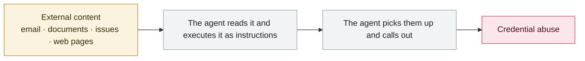

# Meta AI support bot tricked into handing over an Instagram account

      

## Summary

See the expanded entry in 2026-06

## Attack chain

## Sources

| # | Source | Link |
|---|---|---|
| 1 | Krebs | <https://krebsonsecurity.com/2026/06/hackers-used-metas-ai-support-bot-to-seize-instagram-accounts/> |

## Metadata

| Field | Value |
|---|---|
| Date | `2026-04-17` → `2026-05-31` (raw: 2026-04-17→05-31, precision `day`) |
| Kind | Incident `incident` |
| Type | [`IPI`](../../taxonomy/types.md#ipi) Indirect prompt injection · [`CRED`](../../taxonomy/types.md#cred) Credential abuse |
| Severity | **High** `high` |
| Confidence | **A** — primary source (vendor / victim / law enforcement / official report) |
| Real harm | Yes |
| AI involvement | Confirmed `confirmed` |
| Region | [Global](../../regions/global.md) |
| Archive ID | `2026-04-17-meta-instagram-ke-fu-ji` |

**Why this classification:** Real incident with a confirmed victim. Rated `high`: real damage is limited in scope, or it is a CVSS 9+ severe flaw, or a capability demonstration of significance. Grading criteria: see [taxonomy/severity.md](../../taxonomy/severity.md) and [taxonomy/confidence.md](../../taxonomy/confidence.md).

## Related

**Topic:** [Zero-click data exfiltration chain](../../topics/zero-click-exfil.md)

**Related records:**

- `2026-04-01` [Three CVEs in the Claude Code GitHub Action: a PR title steals your API key](2026-04-01-claude-code-github-action.md)   Three CVEs in the Claude Code GitHub Action: a PR title steals your API key
- `2026-04-15` [ShareLeak (CVE-2026-21520) and PipeLeak](2026-04-15-shareleak-pipeleak.md)   ShareLeak (CVE-2026-21520) and PipeLeak
- `2026-04-19` [Vercel OAuth supply-chain intrusion](2026-04-19-vercel-oauth-gong-ying-lian.md)   Vercel OAuth supply-chain intrusion
- `2026-04-21` [Unauthorised access to Anthropic's "Mythos"](2026-04-21-anthropic-mythos-zao-shou-quan.md)   Unauthorised access to Anthropic's "Mythos"

---

[← 2026-04 index](README.md) · [← All records](../../README.md) · [Chinese](../i18n/zh/2026-04/2026-04-17-meta-instagram-ke-fu-ji.md)

This record is part of the **Orca AI Incident Archive**, licensed [CC BY 4.0](../../LICENSE). Found a factual error or a missing source? [Open an issue or PR](../../CONTRIBUTING.md) — corrections are recorded in the record's revision history, never silently overwritten.
