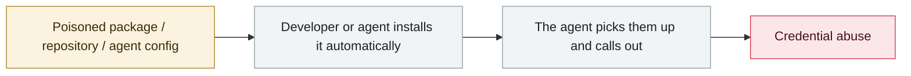

# Vercel OAuth supply-chain intrusion

      

## Summary

A Context.ai employee was hit by **Lumma Stealer** → the attacker stole the **Google Workspace OAuth token** a Vercel employee had granted Context.ai → pivoting to obtain Vercel's API keys and database connection strings. **The upstream of the AI ecosystem was breached, affecting a downstream deployment platform**; the over-broad scope of the OAuth token was the main reason it spread

## Attack chain

## Sources

| # | Source | Link |
|---|---|---|
| 1 | Vercel official | <https://vercel.com/kb/bulletin/vercel-april-2026-security-incident> |
| 2 | Trend Micro | <https://www.trendmicro.com/en_us/research/26/d/vercel-breach-oauth-supply-chain.html> |

## Metadata

| Field | Value |
|---|---|
| Date | `2026-04-19` (raw: 2026-04-19, precision `day`) |
| Kind | Incident `incident` |
| Type | [`SUPPLY`](../../taxonomy/types.md#supply) Supply-chain poisoning · [`CRED`](../../taxonomy/types.md#cred) Credential abuse |
| Severity | **High** `high` |
| Confidence | **A** — primary source (vendor / victim / law enforcement / official report) |
| Real harm | Yes |
| AI involvement | Confirmed `confirmed` |
| Region | [Global](../../regions/global.md) |
| Archive ID | `2026-04-19-vercel-oauth-gong-ying-lian` |

**Why this classification:** Real incident with a confirmed victim. Rated `high`: real damage is limited in scope, or it is a CVSS 9+ severe flaw, or a capability demonstration of significance. Grading criteria: see [taxonomy/severity.md](../../taxonomy/severity.md) and [taxonomy/confidence.md](../../taxonomy/confidence.md).

## Related

**Topic:** [Agent supply-chain poisoning](../../topics/agent-supply-chain.md)

**Related records:**

- `2026-04-01` [Three CVEs in the Claude Code GitHub Action: a PR title steals your API key](2026-04-01-claude-code-github-action.md)   Three CVEs in the Claude Code GitHub Action: a PR title steals your API key
- `2026-04-21` [Unauthorised access to Anthropic's "Mythos"](2026-04-21-anthropic-mythos-zao-shou-quan.md)   Unauthorised access to Anthropic's "Mythos"
- `2026-04-24` [Gemini CLI CVSS 10.0: one pull request compromises CI](2026-04-24-gemini-cli-pr-ci.md)   Gemini CLI CVSS 10.0: one pull request compromises CI
- `2026-04-30` [Apple Support app ships an internal CLAUDE.md by mistake](2026-04-30-apple-support-app-claude-md.md)   Apple Support app ships an internal CLAUDE.md by mistake

---

[← 2026-04 index](README.md) · [← All records](../../README.md) · [Chinese](../i18n/zh/2026-04/2026-04-19-vercel-oauth-gong-ying-lian.md)

This record is part of the **Orca AI Incident Archive**, licensed [CC BY 4.0](../../LICENSE). Found a factual error or a missing source? [Open an issue or PR](../../CONTRIBUTING.md) — corrections are recorded in the record's revision history, never silently overwritten.
