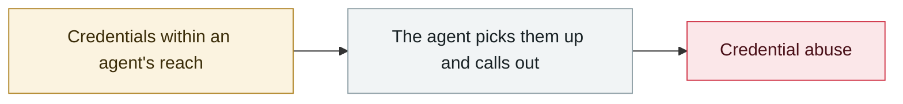

# Unauthorised access to Anthropic's "Mythos"

     

## Summary

Accessed by unauthorised users through a third-party vendor's environment. The model has advanced reasoning and vulnerability-identification capabilities, a "step change" capability that cuts both ways for offence and defence

## Attack chain

## Sources

| # | Source | Link |
|---|---|---|
| 1 | Bloomberg | <https://www.bloomberg.com/news/articles/2026-04-21/anthropic-s-mythos-model-is-being-accessed-by-unauthorized-users> |
| 2 | Reuters | <https://www.reuters.com/technology/anthropics-mythos-model-accessed-by-unauthorized-users-bloomberg-news-reports-2026-04-21/> |

## Metadata

| Field | Value |
|---|---|
| Date | `2026-04-21` (raw: 2026-04-21, precision `day`) |
| Kind | Incident `incident` |
| Type | [`CRED`](../../taxonomy/types.md#cred) Credential abuse |
| Severity | **High** `high` |
| Confidence | **A** — primary source (vendor / victim / law enforcement / official report) |
| Real harm | Yes |
| AI involvement | Confirmed `confirmed` |
| Region | [Global](../../regions/global.md) |
| Archive ID | `2026-04-21-anthropic-mythos-zao-shou-quan` |

**Why this classification:** Real incident with a confirmed victim. Rated `high`: real damage is limited in scope, or it is a CVSS 9+ severe flaw, or a capability demonstration of significance. Grading criteria: see [taxonomy/severity.md](../../taxonomy/severity.md) and [taxonomy/confidence.md](../../taxonomy/confidence.md).

## Related

**Related records:**

- `2026-04-01` [Three CVEs in the Claude Code GitHub Action: a PR title steals your API key](2026-04-01-claude-code-github-action.md)   Three CVEs in the Claude Code GitHub Action: a PR title steals your API key
- `2026-04-19` [Vercel OAuth supply-chain intrusion](2026-04-19-vercel-oauth-gong-ying-lian.md)   Vercel OAuth supply-chain intrusion
- `2026-04-30` [Apple Support app ships an internal CLAUDE.md by mistake](2026-04-30-apple-support-app-claude-md.md)   Apple Support app ships an internal CLAUDE.md by mistake
- `2026-04-17` [Meta AI support bot tricked into handing over an Instagram account](2026-04-17-meta-instagram-ke-fu-ji.md)   Meta AI support bot tricked into handing over an Instagram account

---

[← 2026-04 index](README.md) · [← All records](../../README.md) · [Chinese](../i18n/zh/2026-04/2026-04-21-anthropic-mythos-zao-shou-quan.md)

This record is part of the **Orca AI Incident Archive**, licensed [CC BY 4.0](../../LICENSE). Found a factual error or a missing source? [Open an issue or PR](../../CONTRIBUTING.md) — corrections are recorded in the record's revision history, never silently overwritten.
