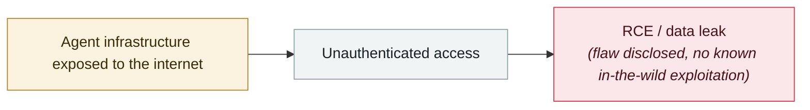

# OpenClaw "Claw Chain": four chained flaws, 245,000 servers exposed

     

## Summary

The **Cyera** research team disclosed four previously unpublished vulnerabilities to the maintainers in 2026-04 (all now fixed):

**CVE-2026-44112** (CVSS 9.6) a **TOCTOU race condition** in the OpenShell sandbox that can redirect writes outside the sandbox, enabling configuration tampering and a persistent host backdoor

**CVE-2026-44115** (8.8) a gap between command validation and shell execution, where **environment variables (API keys, tokens, credentials) can leak through an unquoted heredoc that looks harmless at validation time**

**CVE-2026-44118** (7.8) blindly trusting the client-controlled `senderIsOwner` flag without checking the authenticated session, so a local process holding a valid bearer token can escalate to owner level

Exposure: Shodan ~65,000 + ZoomEye ~180,000 ≈ **245,000 reachable with no internal-network precondition at all**. Financial, healthcare and legal sectors are at highest risk

## Attack chain

## Sources

| # | Source | Link |
|---|---|---|
| 1 | CybersecurityNews | <https://cybersecuritynews.com/openclaw-chain-vulnerabilities/> |
| 2 | CSA | <https://labs.cloudsecurityalliance.org/research/csa-research-note-openclaw-claw-chain-cve-20260517-csa-style/> |

## Metadata

| Field | Value |
|---|---|
| Date | `2026-04-23` (raw: 2026-04-23, precision `day`) |
| Kind | Vulnerability disclosure `vulnerability` |
| Type | [`INFRA`](../../taxonomy/types.md#infra) Agent infrastructure exposure |
| Severity | **High** `high` |
| Confidence | **A** — primary source (vendor / victim / law enforcement / official report) |
| Real harm | No |
| AI involvement | Confirmed `confirmed` |
| Region | [Global](../../regions/global.md) |
| Archive ID | `2026-04-23-openclaw-claw-chain` |

**Why this classification:** Vulnerability disclosure; as of archiving there is no evidence of in-the-wild exploitation, so `real_harm: false`. Rated `high`: real damage is limited in scope, or it is a CVSS 9+ severe flaw, or a capability demonstration of significance. Grading criteria: see [taxonomy/severity.md](../../taxonomy/severity.md) and [taxonomy/confidence.md](../../taxonomy/confidence.md).

## Related

**Topic:** [Agent infrastructure exposure](../../topics/agent-infra.md)

**Related records:**

- `2026-04-16` [MCPwn (CVE-2026-33032): nginx-ui MCP endpoint hit in the wild](2026-04-16-mcpwn-nginx-ui-in-the-wild.md)   MCPwn (CVE-2026-33032): nginx-ui MCP endpoint hit in the wild
- `2026-04-07` [Flowise CVE-2025-59528 exploited in the wild](2026-04-07-flowise-ye-li-yong.md)   Flowise CVE-2025-59528 exploited in the wild
- `2026-04-01` [Google Vertex AI "Double Agent" permission abuse](2026-04-01-google-vertex-double-agent.md)   Google Vertex AI "Double Agent" permission abuse
- `2026-04-06` [OpenClaw's CVE rate: 2.2 per day](2026-04-06-openclaw-chan-chu-su-lv.md)   OpenClaw's CVE rate: 2.2 per day

---

[← 2026-04 index](README.md) · [← All records](../../README.md) · [Chinese](../i18n/zh/2026-04/2026-04-23-openclaw-claw-chain.md)

This record is part of the **Orca AI Incident Archive**, licensed [CC BY 4.0](../../LICENSE). Found a factual error or a missing source? [Open an issue or PR](../../CONTRIBUTING.md) — corrections are recorded in the record's revision history, never silently overwritten.
