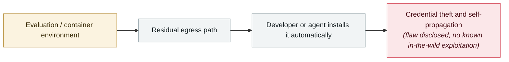

# Gemini CLI CVSS 10.0: one pull request compromises CI

      

## Summary

Google advisory **GHSA-wpqr-6v78-jr5g**, **CVSS 3.1 score 10.0**, **no CVE assigned**. Two design gaps combine: (1) **headless mode automatically trusts any workspace directory it processes** — a malicious `.gemini/` config is loaded without user consent; (2) **`--yolo` mode ignores the fine-grained tool allowlist** — a prompt injection can invoke arbitrary shell commands.

Result: **an unprivileged outsider (say, a contributor submitting a PR) can execute commands on the CI runner before the Gemini sandbox initialises**, obtaining secrets, credentials and source code from the workflow environment. Fixed in: `@google/gemini-cli` v0.39.1+ (preview line v0.40.0-preview.3), `google-github-actions/run-gemini-cli` v0.1.22+

## Attack chain

## Sources

| # | Source | Link |
|---|---|---|
| 1 | THN | <https://thehackernews.com/2026/04/google-fixes-cvss-10-gemini-cli-ci-rce.html> |
| 2 | HackRead | <https://hackread.com/google-cvss-10-gemini-cli-vulnerability-github-rce/> |
| 3 | CSA | <https://labs.cloudsecurityalliance.org/research/csa-research-note-gemini-cli-rce-cvss10-ai-tool-security-202/> |

## Metadata

| Field | Value |
|---|---|
| Date | `2026-04-24` (raw: 2026-04-24, precision `day`) |
| Kind | Vulnerability disclosure `vulnerability` |
| Type | [`SANDBOX`](../../taxonomy/types.md#sandbox) Sandbox escape · [`SUPPLY`](../../taxonomy/types.md#supply) Supply-chain poisoning |
| Severity | **High** `high` |
| Confidence | **A** — primary source (vendor / victim / law enforcement / official report) |
| Real harm | No |
| AI involvement | Confirmed `confirmed` |
| Region | [Global](../../regions/global.md) |
| Archive ID | `2026-04-24-gemini-cli-pr-ci` |

**Why this classification:** Vulnerability disclosure; as of archiving there is no evidence of in-the-wild exploitation, so `real_harm: false`. Rated `high`: real damage is limited in scope, or it is a CVSS 9+ severe flaw, or a capability demonstration of significance. Grading criteria: see [taxonomy/severity.md](../../taxonomy/severity.md) and [taxonomy/confidence.md](../../taxonomy/confidence.md).

## Related

**Topic:** [Frontier model autonomous overreach](../../topics/eval-escapes.md) · [Agent supply-chain poisoning](../../topics/agent-supply-chain.md)

**Related records:**

- `2026-04-15` [Windsurf zero-click MCP RCE (CVE-2026-30615)](2026-04-15-windsurf-mcp-rce.md)   Windsurf zero-click MCP RCE (CVE-2026-30615)
- `2026-04-19` [Vercel OAuth supply-chain intrusion](2026-04-19-vercel-oauth-gong-ying-lian.md)   Vercel OAuth supply-chain intrusion
- `2026-04-28` [OpenAI Codex sandbox-escape zero-day](2026-04-28-codex-sha-xiang-rao-guo.md)   OpenAI Codex sandbox-escape zero-day
- `2026-03-01` [Hades: a sustained campaign turning AI coding assistants into the attack surface](../2026-03/2026-03-01-hades-campaign-ai-coding-assistants.md)   Hades: a sustained campaign turning AI coding assistants into the attack surface

---

[← 2026-04 index](README.md) · [← All records](../../README.md) · [Chinese](../i18n/zh/2026-04/2026-04-24-gemini-cli-pr-ci.md)

This record is part of the **Orca AI Incident Archive**, licensed [CC BY 4.0](../../LICENSE). Found a factual error or a missing source? [Open an issue or PR](../../CONTRIBUTING.md) — corrections are recorded in the record's revision history, never silently overwritten.
