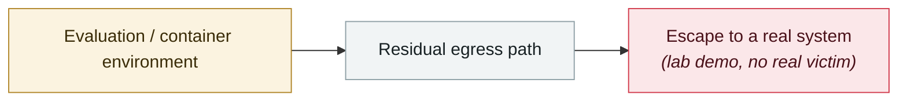

# OpenAI Codex sandbox-escape zero-day

     

## Summary

Trend ZDI-26-305, CVSS 8.6, improper isolation of the JS execution environment. Requires the user to work with a malicious repository. **OpenAI acknowledges the vulnerability but declined to fix it** (saying it is out of bounty scope and not part of the product's default exposure surface), so it has stayed unfixed, with restricted use the only mitigation

## Attack chain

## Sources

| # | Source | Link |
|---|---|---|
| 1 | ZDI | <https://www.zerodayinitiative.com/advisories/ZDI-26-305/> |
| 2 | Impress Watch | <https://forest.watch.impress.co.jp/docs/news/2105656.html> |

## Metadata

| Field | Value |
|---|---|
| Date | `2026-04-28` (raw: 2026-04-28, precision `day`) |
| Kind | Research demo `research` |
| Type | [`SANDBOX`](../../taxonomy/types.md#sandbox) Sandbox escape |
| Severity | **Medium** `medium` |
| Confidence | **A** — primary source (vendor / victim / law enforcement / official report) |
| Real harm | No |
| AI involvement | Confirmed `confirmed` |
| Region | [Global](../../regions/global.md) |
| Archive ID | `2026-04-28-codex-sha-xiang-rao-guo` |

**Why this classification:** Controlled demo by a research lab or vendor, `real_harm: false`; the record marks when the attack surface became public. Rated `medium`: controlled demo, moderate flaw, or an incident limited to a single user / single machine. Grading criteria: see [taxonomy/severity.md](../../taxonomy/severity.md) and [taxonomy/confidence.md](../../taxonomy/confidence.md).

## Related

**Topic:** [Frontier model autonomous overreach](../../topics/eval-escapes.md)

**Related records:**

- `2026-04-15` [Windsurf zero-click MCP RCE (CVE-2026-30615)](2026-04-15-windsurf-mcp-rce.md)   Windsurf zero-click MCP RCE (CVE-2026-30615)
- `2026-04-24` [Gemini CLI CVSS 10.0: one pull request compromises CI](2026-04-24-gemini-cli-pr-ci.md)   Gemini CLI CVSS 10.0: one pull request compromises CI
- `2026-05-08` [Cline Kanban cross-origin WebSocket hijack (CVE-2026-44211)](../2026-05/2026-05-08-cline-kanban-websocket.md)   Cline Kanban cross-origin WebSocket hijack (CVE-2026-44211)
- `2026-05-07` [TrustFall: RCE on a single keypress](../2026-05/2026-05-07-trustfall-rce-yi-ci-hui.md)   TrustFall: RCE on a single keypress

---

[← 2026-04 index](README.md) · [← All records](../../README.md) · [Chinese](../i18n/zh/2026-04/2026-04-28-codex-sha-xiang-rao-guo.md)

This record is part of the **Orca AI Incident Archive**, licensed [CC BY 4.0](../../LICENSE). Found a factual error or a missing source? [Open an issue or PR](../../CONTRIBUTING.md) — corrections are recorded in the record's revision history, never silently overwritten.
