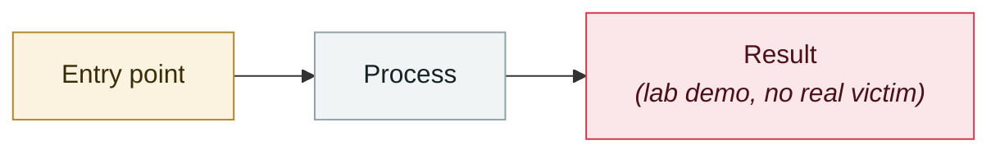

# Linux "Copy Fail" CVE-2026-31431

     

## Summary

No direct AI connection, but it sits within the 2026 backdrop of "AI-accelerated vulnerability discovery"

## Attack chain

## Sources

| # | Source | Link |
|---|---|---|
| 1 | copy.fail | <https://copy.fail/> |

## Metadata

| Field | Value |
|---|---|
| Date | `2026-04-29` (raw: 2026-04-29, precision `day`) |
| Kind | Research demo `research` |
| Type | [`OTHER`](../../taxonomy/types.md#other) Other |
| Severity | **Low** `low` |
| Confidence | **A** — primary source (vendor / victim / law enforcement / official report) |
| Real harm | No |
| AI involvement | Not applicable `not-applicable` |
| Region | [Global](../../regions/global.md) |
| Archive ID | `2026-04-29-linux-copy-fail` |

**Why this classification:** Controlled demo by a research lab or vendor, `real_harm: false`; the record marks when the attack surface became public. Rated `low`: context entry, kept for timeline continuity. Grading criteria: see [taxonomy/severity.md](../../taxonomy/severity.md) and [taxonomy/confidence.md](../../taxonomy/confidence.md).

---

[← 2026-04 index](README.md) · [← All records](../../README.md) · [Chinese](../i18n/zh/2026-04/2026-04-29-linux-copy-fail.md)

This record is part of the **Orca AI Incident Archive**, licensed [CC BY 4.0](../../LICENSE). Found a factual error or a missing source? [Open an issue or PR](../../CONTRIBUTING.md) — corrections are recorded in the record's revision history, never silently overwritten.
