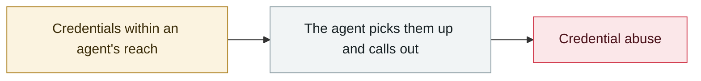

# Apple Support app ships an internal CLAUDE.md by mistake

     

## Summary

The v5.13 production build shipped an internal configuration file meant for Claude Code, leaking internal architecture decisions such as the "Juno AI" design, the Actor concurrency model and the UI component library. What leaked was **development standards and architecture decisions** rather than user data, but it handed attackers a map of the attack surface

## Attack chain

## Sources

| # | Source | Link |
|---|---|---|
| 1 | Original post (X) | <https://x.com/aaronp613/status/2049986504617820551> |
| 2 | Medium analysis | <https://medium.com/vibe-coding/what-apples-leaked-claude-md-teaches-us-b8269e2ace51> |

## Metadata

| Field | Value |
|---|---|
| Date | `2026-04-30` (raw: 2026-04-30, precision `day`) |
| Kind | Incident `incident` |
| Type | [`CRED`](../../taxonomy/types.md#cred) Credential abuse |
| Severity | **High** `high` |
| Confidence | **A** — primary source (vendor / victim / law enforcement / official report) |
| Real harm | Yes |
| AI involvement | Confirmed `confirmed` |
| Region | [United States](../../regions/us.md) |
| Archive ID | `2026-04-30-apple-support-app-claude-md` |

**Why this classification:** Real incident with a confirmed victim. Rated `high`: real damage is limited in scope, or it is a CVSS 9+ severe flaw, or a capability demonstration of significance. Grading criteria: see [taxonomy/severity.md](../../taxonomy/severity.md) and [taxonomy/confidence.md](../../taxonomy/confidence.md).

## Related

**Related records:**

- `2026-04-01` [Three CVEs in the Claude Code GitHub Action: a PR title steals your API key](2026-04-01-claude-code-github-action.md)   Three CVEs in the Claude Code GitHub Action: a PR title steals your API key
- `2026-04-19` [Vercel OAuth supply-chain intrusion](2026-04-19-vercel-oauth-gong-ying-lian.md)   Vercel OAuth supply-chain intrusion
- `2026-04-21` [Unauthorised access to Anthropic's "Mythos"](2026-04-21-anthropic-mythos-zao-shou-quan.md)   Unauthorised access to Anthropic's "Mythos"
- `2026-04-17` [Meta AI support bot tricked into handing over an Instagram account](2026-04-17-meta-instagram-ke-fu-ji.md)   Meta AI support bot tricked into handing over an Instagram account

---

[← 2026-04 index](README.md) · [← All records](../../README.md) · [Chinese](../i18n/zh/2026-04/2026-04-30-apple-support-app-claude-md.md)

This record is part of the **Orca AI Incident Archive**, licensed [CC BY 4.0](../../LICENSE). Found a factual error or a missing source? [Open an issue or PR](../../CONTRIBUTING.md) — corrections are recorded in the record's revision history, never silently overwritten.
