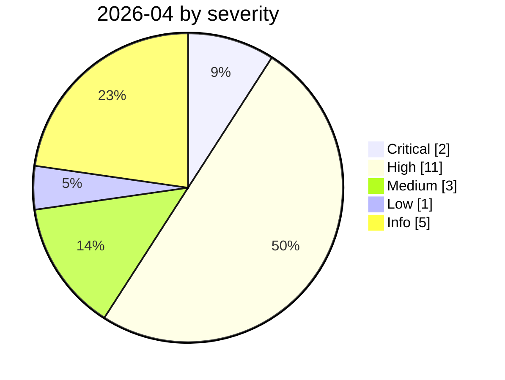

# 2026-04

<!-- BEGIN:summary -->
**22** records

     

## Records this month

| Date | Record | Type | Severity | Confidence | Real harm |
|---|---|---|---|---|---|
| `04-01` | [Three CVEs in the Claude Code GitHub Action: a PR title steals your API key](2026-04-01-claude-code-github-action.md) | `IPI` `CRED` | **High** | A | — |
| `04-01` | [Google Vertex AI "Double Agent" permission abuse](2026-04-01-google-vertex-double-agent.md) | `INFRA` | Medium | A | — |
| `04-06` | [OpenClaw's CVE rate: 2.2 per day](2026-04-06-openclaw-chan-chu-su-lv.md) | `INFRA` | Info | B | · |
| `04-07` | [Flowise CVE-2025-59528 exploited in the wild](2026-04-07-flowise-ye-li-yong.md) | `INFRA` | **High** | A | ✅ |
| `04-07` | [GrafanaGhost indirect prompt injection](2026-04-07-grafanaghost-jian-jie-ti-shi.md) | `IPI` `EXFIL` | Medium | A | — |
| `04-07` | [Claude Mythos Preview cyber capability disclosure, Project Glasswing formed](2026-04-07-claude-mythos-preview-project.md) | `GOV` | Info | A | · |
| `04-08` | [Aurora ransomware operators use Cursor Agent in live intrusions](2026-04-08-aurora-cursor-agent.md) | `WEAPON` | **High** | A | ✅ |
| `04-13` | [UK AISI independently evaluates Claude Mythos Preview](2026-04-13-uk-aisi-claude-mythos.md) | `GOV` | Info | A | · |
| `04-14` | [Vidoc reproduces Mythos's findings with public models](2026-04-14-vidoc-mythos-yong-gong-kai.md) | `GOV` | Info | A | · |
| `04-15` | [ShareLeak (CVE-2026-21520) and PipeLeak](2026-04-15-shareleak-pipeleak.md) ⚠️ | `IPI` `EXFIL` | **High** | A | — |
| `04-15` | [Windsurf zero-click MCP RCE (CVE-2026-30615)](2026-04-15-windsurf-mcp-rce.md) | `SANDBOX` `MCP` | **High** | A | — |
| `04-16` | ★ [MCPwn (CVE-2026-33032): nginx-ui MCP endpoint hit in the wild](2026-04-16-mcpwn-nginx-ui-in-the-wild.md) | `MCP` `INFRA` | **Critical** | A | ✅ |
| `04-17` | [Meta AI support bot tricked into handing over an Instagram account](2026-04-17-meta-instagram-ke-fu-ji.md) | `IPI` `CRED` | **High** | A | ✅ |
| `04-19` | [Vercel OAuth supply-chain intrusion](2026-04-19-vercel-oauth-gong-ying-lian.md) | `SUPPLY` `CRED` | **High** | A | ✅ |
| `04-21` | [Unauthorised access to Anthropic's "Mythos"](2026-04-21-anthropic-mythos-zao-shou-quan.md) | `CRED` | **High** | A | ✅ |
| `04-23` | [OpenClaw "Claw Chain": four chained flaws, 245,000 servers exposed](2026-04-23-openclaw-claw-chain.md) | `INFRA` | **High** | A | — |
| `04-24` | [Gemini CLI CVSS 10.0: one pull request compromises CI](2026-04-24-gemini-cli-pr-ci.md) | `SANDBOX` `SUPPLY` | **High** | A | — |
| `04-25` | ★ [Cursor and Claude Opus 4.6 wipe production and backups in nine seconds](2026-04-25-cursor-opus-46-nine-second-wipe.md) | `ROGUE` | **Critical** | A | ✅ |
| `04-28` | [OpenAI Codex sandbox-escape zero-day](2026-04-28-codex-sha-xiang-rao-guo.md) | `SANDBOX` | Medium | A | — |
| `04-29` | [Linux "Copy Fail" CVE-2026-31431](2026-04-29-linux-copy-fail.md) | `OTHER` | Low | A | — |
| `04-30` | [Apple Support app ships an internal CLAUDE.md by mistake](2026-04-30-apple-support-app-claude-md.md) | `CRED` | **High** | A | ✅ |
| `04-30` | [OpenAI launches Advanced Account Security](2026-04-30-tui-chu-gao-ji-zhang.md) | `GOV` | Info | A | · |

★ = `critical` · ⚠️ = disputed facts or attribution · real harm: ✅ confirmed victim / — none / · not applicable (policy and intelligence reports)
<!-- END:summary -->

<!-- BEGIN:nav -->
---

[← 2026-03](../2026-03/README.md) · [Archive index](../../README.md) · [By type](../../taxonomy/types.md) · [2026-05 →](../2026-05/README.md)
<!-- END:nav -->
