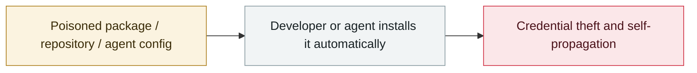

# Fake OpenAI repository tops the Hugging Face trending list

     

## Summary

HiddenLayer: the repository `Open-OSS/privacy-filter` impersonated OpenAI's Privacy Filter release, **copying the legitimate model card almost verbatim** and combining it with typosquatting. **Within 18 hours it reached #1 on the Hugging Face trending list, accumulating 244,000+ downloads and 667 likes** (the download and like counts are assessed as automated inflation). A hidden `loader.py` pulled PowerShell commands from a remote server and ran them silently, ultimately dropping an **infostealer written in Rust** aimed at Chromium/Firefox-family browsers, Discord local storage, crypto wallets, FileZilla configs and host information. HiddenLayer also found **six more repositories under another account using near-identical loader logic and shared infrastructure**

## Attack chain

## Sources

| # | Source | Link |
|---|---|---|
| 1 | BleepingComputer | <https://www.bleepingcomputer.com/news/security/fake-openai-repository-on-hugging-face-pushes-infostealer-malware/> |
| 2 | CSO Online | <https://www.csoonline.com/article/4169407/malicious-hugging-face-model-masquerading-as-openai-release-hits-244k-downloads.html> |

## Metadata

| Field | Value |
|---|---|
| Date | `2026-05-01` (raw: 2026-05, precision `month`) |
| Kind | Incident `incident` |
| Type | [`SUPPLY`](../../taxonomy/types.md#supply) Supply-chain poisoning |
| Severity | **High** `high` |
| Confidence | **A** — primary source (vendor / victim / law enforcement / official report) |
| Real harm | Yes |
| AI involvement | Confirmed `confirmed` |
| Region | [Global](../../regions/global.md) |
| Archive ID | `2026-05-01-hugging-face-jia-mao-cang` |

**Why this classification:** Real incident with a confirmed victim. Rated `high`: real damage is limited in scope, or it is a CVSS 9+ severe flaw, or a capability demonstration of significance. Grading criteria: see [taxonomy/severity.md](../../taxonomy/severity.md) and [taxonomy/confidence.md](../../taxonomy/confidence.md).

## Related

**Topic:** [Agent supply-chain poisoning](../../topics/agent-supply-chain.md)

**Related records:**

- `2026-05-19` [TrapDoor: poisoning three ecosystems to corrupt AI assistant configs](2026-05-19-trapdoor-poisons-agent-configs.md)   TrapDoor: poisoning three ecosystems to corrupt AI assistant configs
- `2026-05-21` [Composio: agent automation itself becomes the privilege-escalation path](2026-05-21-composio-agent-automation-privesc.md)   Composio: agent automation itself becomes the privilege-escalation path
- `2026-05-11` [TanStack npm "Mini Shai-Hulud"](2026-05-11-tanstack-npm-mini-shai.md)   TanStack npm "Mini Shai-Hulud"
- `2026-05-18` [3,800 internal GitHub repositories compromised](2026-05-18-github-3800-internal-repos.md)   3,800 internal GitHub repositories compromised

---

[← 2026-05 index](README.md) · [← All records](../../README.md) · [Chinese](../i18n/zh/2026-05/2026-05-01-hugging-face-jia-mao-cang.md)

This record is part of the **Orca AI Incident Archive**, licensed [CC BY 4.0](../../LICENSE). Found a factual error or a missing source? [Open an issue or PR](../../CONTRIBUTING.md) — corrections are recorded in the record's revision history, never silently overwritten.
