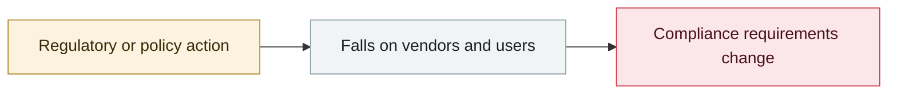

# Pwn2Own Berlin 2026: 47 zero-days as AI floods the entry list

     

## Summary

$1,298,250 in prize money; dozens of submissions were rejected, as AI-driven entry volume exceeded what the event could handle

## Attack chain

## Sources

| # | Source | Link |
|---|---|---|
| 1 | Theori | <https://theori.io/ko/blog/2026-h1-hot-security-issue-case> |

## Metadata

| Field | Value |
|---|---|
| Date | `2026-05-01` (raw: 2026-05, precision `month`) |
| Kind | Policy & regulation `policy` |
| Type | [`GOV`](../../taxonomy/types.md#gov) Governance & policy |
| Severity | **Info** `info` |
| Confidence | **B** — research lab or major outlet with checkable detail |
| Real harm | n/a |
| AI involvement | Confirmed `confirmed` |
| Region | [Europe](../../regions/eu.md) |
| Archive ID | `2026-05-01-pwn2own-berlin-ling-can-sai` |

**Why this classification:** Policy / regulatory action, not counted in incident statistics; `severity` is recorded as `info`. Grading criteria: see [taxonomy/severity.md](../../taxonomy/severity.md) and [taxonomy/confidence.md](../../taxonomy/confidence.md).

## Related

**Topic:** [Defense & governance](../../topics/defense.md)

**Related records:**

- `2026-05-12` [Brazilian labour court sanctions lawyers over prompt injection](2026-05-12-brazil-labor-court-prompt-injection-sanction.md)   Brazilian labour court sanctions lawyers over prompt injection
- `2026-05-04` [Five Eyes: agentic AI is not ready for rapid rollout](2026-05-04-five-eyes-agentic.md)   Five Eyes: agentic AI is not ready for rapid rollout
- `2026-05-27` [Anthropic publishes "Zero Trust for AI agents"](2026-05-27-anthropic-zero-trust-agents.md)   Anthropic publishes "Zero Trust for AI agents"
- `2026-04-07` [Claude Mythos Preview cyber capability disclosure, Project Glasswing formed](../2026-04/2026-04-07-claude-mythos-preview-project.md)   Claude Mythos Preview cyber capability disclosure, Project Glasswing formed

---

[← 2026-05 index](README.md) · [← All records](../../README.md) · [Chinese](../i18n/zh/2026-05/2026-05-01-pwn2own-berlin-ling-can-sai.md)

This record is part of the **Orca AI Incident Archive**, licensed [CC BY 4.0](../../LICENSE). Found a factual error or a missing source? [Open an issue or PR](../../CONTRIBUTING.md) — corrections are recorded in the record's revision history, never silently overwritten.
