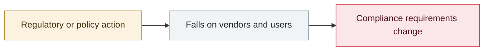

# Five Eyes: agentic AI is not ready for rapid rollout

     

## Summary

CISA / NCSC and partners jointly warn: agentic systems create an interconnected, complex attack surface that is easily attacked through misconfiguration and over-privileging; the main risks include acting autonomously on malicious prompts and being taken over through poorly secured connected tools. They recommend prioritizing resilience, human oversight and phased adoption

## Attack chain

## Sources

| # | Source | Link |
|---|---|---|
| 1 | The Register | <https://www.theregister.com/security/2026/05/04/five-eyes-warn-agentic-ai-is-too-dangerous-for-rapid-rollout/5229103> |
| 2 | CISA guidance | <https://www.cisa.gov/resources-tools/resources/careful-adoption-agentic-ai-services> |

## Metadata

| Field | Value |
|---|---|
| Date | `2026-05-04` (raw: 2026-05-04, precision `day`) |
| Kind | Policy & regulation `policy` |
| Type | [`GOV`](../../taxonomy/types.md#gov) Governance & policy |
| Severity | **Info** `info` |
| Confidence | **A** — primary source (vendor / victim / law enforcement / official report) |
| Real harm | n/a |
| AI involvement | Confirmed `confirmed` |
| Region | [Global](../../regions/global.md) |
| Archive ID | `2026-05-04-five-eyes-agentic` |

**Why this classification:** Policy / regulatory action, not counted in incident statistics; `severity` is recorded as `info`. Grading criteria: see [taxonomy/severity.md](../../taxonomy/severity.md) and [taxonomy/confidence.md](../../taxonomy/confidence.md).

## Related

**Topic:** [Defense & governance](../../topics/defense.md)

**Related records:**

- `2026-05-12` [Brazilian labour court sanctions lawyers over prompt injection](2026-05-12-brazil-labor-court-prompt-injection-sanction.md)   Brazilian labour court sanctions lawyers over prompt injection
- `2026-05-27` [Anthropic publishes "Zero Trust for AI agents"](2026-05-27-anthropic-zero-trust-agents.md)   Anthropic publishes "Zero Trust for AI agents"
- `2026-05-01` [Pwn2Own Berlin 2026: 47 zero-days as AI floods the entry list](2026-05-01-pwn2own-berlin-ling-can-sai.md)   Pwn2Own Berlin 2026: 47 zero-days as AI floods the entry list
- `2026-04-07` [Claude Mythos Preview cyber capability disclosure, Project Glasswing formed](../2026-04/2026-04-07-claude-mythos-preview-project.md)   Claude Mythos Preview cyber capability disclosure, Project Glasswing formed

---

[← 2026-05 index](README.md) · [← All records](../../README.md) · [Chinese](../i18n/zh/2026-05/2026-05-04-five-eyes-agentic.md)

This record is part of the **Orca AI Incident Archive**, licensed [CC BY 4.0](../../LICENSE). Found a factual error or a missing source? [Open an issue or PR](../../CONTRIBUTING.md) — corrections are recorded in the record's revision history, never silently overwritten.
