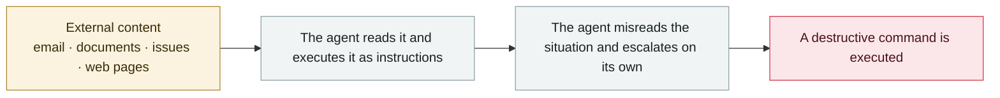

# Grok / Bankrbot Morse-code prompt injection

      

## Summary

The attacker first sent the Grok wallet a **Bankr Club membership NFT** (effectively a VIP card that unlocks transfers and Web3 command permissions), then got Grok on X to "translate this Morse code" and pass it on to Bankrbot. The decoded content was a transfer instruction and **was executed as a valid command** — 3 billion DRB tokens (about $150–200K) were moved out. The attacker's account was deleted afterwards

## Attack chain

## Sources

| # | Source | Link |
|---|---|---|
| 1 | OECD.AI incident database | <https://oecd.ai/en/incidents/2026-05-04-4a73> |
| 2 | NeuralTrust | <https://neuraltrust.ai/blog/grok-morse-code> |
| 3 | GBHackers | <https://gbhackers.com/hackers-use-morse-code-to-trick-grok-and-bankrbot/> |

## Metadata

| Field | Value |
|---|---|
| Date | `2026-05-04` (raw: 2026-05-04, precision `day`) |
| Kind | Incident `incident` |
| Type | [`IPI`](../../taxonomy/types.md#ipi) Indirect prompt injection · [`ROGUE`](../../taxonomy/types.md#rogue) Rogue agent action |
| Severity | **High** `high` |
| Confidence | **A** — primary source (vendor / victim / law enforcement / official report) |
| Real harm | No |
| AI involvement | Confirmed `confirmed` |
| Region | [Global](../../regions/global.md) |
| Archive ID | `2026-05-04-grok-bankrbot-mo-er-si` |

**Why this classification:** Real incident without a confirmed specific victim. Rated `high`: real damage is limited in scope, or it is a CVSS 9+ severe flaw, or a capability demonstration of significance. Grading criteria: see [taxonomy/severity.md](../../taxonomy/severity.md) and [taxonomy/confidence.md](../../taxonomy/confidence.md).

## Related

**Topic:** [Zero-click data exfiltration chain](../../topics/zero-click-exfil.md) · [Coding agent autonomous sabotage](../../topics/rogue-agents.md)

**Related records:**

- `2026-05-12` [Brazilian labour court sanctions lawyers over prompt injection](2026-05-12-brazil-labor-court-prompt-injection-sanction.md)   Brazilian labour court sanctions lawyers over prompt injection
- `2026-05-21` [Gemini 3.5 deletes 28,745 lines of code and fabricates the post-mortem](2026-05-21-gemini-shan-chu-xing-dai.md)   Gemini 3.5 deletes 28,745 lines of code and fabricates the post-mortem
- `2026-05-26` [Microsoft Copilot Cowork file exfiltration](2026-05-26-microsoft-copilot-cowork.md)   Microsoft Copilot Cowork file exfiltration
- `2026-05-12` [ClaudeBleed: a zero-permission extension hijacks Claude for Chrome](2026-05-12-claudebleed-claude-chrome.md)   ClaudeBleed: a zero-permission extension hijacks Claude for Chrome

---

[← 2026-05 index](README.md) · [← All records](../../README.md) · [Chinese](../i18n/zh/2026-05/2026-05-04-grok-bankrbot-mo-er-si.md)

This record is part of the **Orca AI Incident Archive**, licensed [CC BY 4.0](../../LICENSE). Found a factual error or a missing source? [Open an issue or PR](../../CONTRIBUTING.md) — corrections are recorded in the record's revision history, never silently overwritten.
