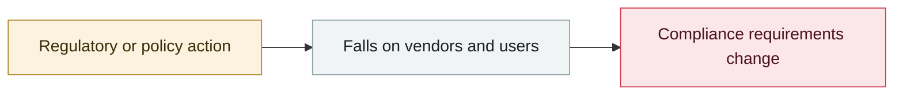

# NewsGuard: Claude cites Russian and Iranian state propaganda more often

     

## Summary

Citations of the "Pravda" network rose markedly; leaked documents from the same period show Russia's **Social Design Agency (SDA)** plans to deploy a German Wikipedia clone with **200,000+ articles** — **data poisoning is now a state-level strategy**

## Attack chain

## Sources

| # | Source | Link |
|---|---|---|
| 1 | NewsGuard | <https://www.newsguardtech.com/special-reports/anthropic-ai-chatbot-claude-russia-iran-propaganda/> |
| 2 | t-online (SDA leak) | <https://www.t-online.de/nachrichten/deutschland/innenpolitik/id_101262296/propaganda-offensive-gegen-deutschland-leak-enthuellt-russlands-vorgehen.html> |

## Metadata

| Field | Value |
|---|---|
| Date | `2026-05-04` (raw: 2026-05-04, precision `day`) |
| Kind | Policy & regulation `policy` |
| Type | [`OTHER`](../../taxonomy/types.md#other) Other |
| Severity | **Info** `info` |
| Confidence | **A** — primary source (vendor / victim / law enforcement / official report) |
| Real harm | n/a |
| AI involvement | Confirmed `confirmed` |
| Region | [Global](../../regions/global.md) |
| Archive ID | `2026-05-04-newsguard-claude-yin-yong-e` |

**Why this classification:** Policy / regulatory action, not counted in incident statistics; `severity` is recorded as `info`. Grading criteria: see [taxonomy/severity.md](../../taxonomy/severity.md) and [taxonomy/confidence.md](../../taxonomy/confidence.md).

---

[← 2026-05 index](README.md) · [← All records](../../README.md) · [Chinese](../i18n/zh/2026-05/2026-05-04-newsguard-claude-yin-yong-e.md)

This record is part of the **Orca AI Incident Archive**, licensed [CC BY 4.0](../../LICENSE). Found a factual error or a missing source? [Open an issue or PR](../../CONTRIBUTING.md) — corrections are recorded in the record's revision history, never silently overwritten.
