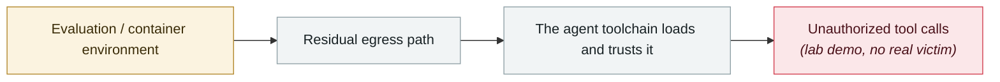

# TrustFall: RCE on a single keypress

      

## Summary

Adversa AI: a systemic architectural flaw affecting four agentic CLIs — **Claude Code, Gemini CLI, Cursor CLI and GitHub Copilot**. After the developer accepts the "folder trust" prompt, a malicious repository config **auto-starts a project-level MCP server** — one Enter press in a developer environment runs the attacker's code with the developer's own privileges, and **in headless CI workflows there is not even a prompt**. Key points: `enableAllProjectMcpServers` **is not banned in project scope the way `bypassPermissions` is**; and **Claude Code v2.1+ removed the earlier MCP warning from its dialog**

## Attack chain

## Sources

| # | Source | Link |
|---|---|---|
| 1 | Adversa | <https://adversa.ai/blog/trustfall-coding-agent-security-flaw-rce-claude-cursor-gemini-cli-copilot/> |
| 2 | Dark Reading | <https://www.darkreading.com/application-security/trustfall-exposes-claude-code-execution-risk> |

## Metadata

| Field | Value |
|---|---|
| Date | `2026-05-07` (raw: 2026-05-07, precision `day`) |
| Kind | Research demo `research` |
| Type | [`SANDBOX`](../../taxonomy/types.md#sandbox) Sandbox escape · [`MCP`](../../taxonomy/types.md#mcp) MCP & tool-chain |
| Severity | **Medium** `medium` |
| Confidence | **A** — primary source (vendor / victim / law enforcement / official report) |
| Real harm | No |
| AI involvement | Confirmed `confirmed` |
| Region | [Global](../../regions/global.md) |
| Archive ID | `2026-05-07-trustfall-rce-yi-ci-hui` |

**Why this classification:** Controlled demo by a research lab or vendor, `real_harm: false`; the record marks when the attack surface became public. Rated `medium`: controlled demo, moderate flaw, or an incident limited to a single user / single machine. Grading criteria: see [taxonomy/severity.md](../../taxonomy/severity.md) and [taxonomy/confidence.md](../../taxonomy/confidence.md).

## Related

**Topic:** [Frontier model autonomous overreach](../../topics/eval-escapes.md) · [Agent supply-chain poisoning](../../topics/agent-supply-chain.md)

**Related records:**

- `2026-05-08` [Cline Kanban cross-origin WebSocket hijack (CVE-2026-44211)](2026-05-08-cline-kanban-websocket.md)   Cline Kanban cross-origin WebSocket hijack (CVE-2026-44211)
- `2026-04-16` [MCPwn (CVE-2026-33032): nginx-ui MCP endpoint hit in the wild](../2026-04/2026-04-16-mcpwn-nginx-ui-in-the-wild.md)   MCPwn (CVE-2026-33032): nginx-ui MCP endpoint hit in the wild
- `2026-04-15` [Windsurf zero-click MCP RCE (CVE-2026-30615)](../2026-04/2026-04-15-windsurf-mcp-rce.md)   Windsurf zero-click MCP RCE (CVE-2026-30615)
- `2026-04-24` [Gemini CLI CVSS 10.0: one pull request compromises CI](../2026-04/2026-04-24-gemini-cli-pr-ci.md)   Gemini CLI CVSS 10.0: one pull request compromises CI

---

[← 2026-05 index](README.md) · [← All records](../../README.md) · [Chinese](../i18n/zh/2026-05/2026-05-07-trustfall-rce-yi-ci-hui.md)

This record is part of the **Orca AI Incident Archive**, licensed [CC BY 4.0](../../LICENSE). Found a factual error or a missing source? [Open an issue or PR](../../CONTRIBUTING.md) — corrections are recorded in the record's revision history, never silently overwritten.
