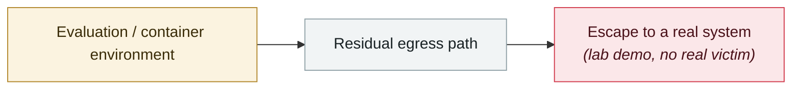

# Cline Kanban cross-origin WebSocket hijack (CVE-2026-44211)

     

## Summary

**CVSS 9.7**, affecting ≤ 2.13.0. The `kanban` npm package used by the cline CLI started a WebSocket service on `127.0.0.1:3484` that **does not validate the Origin header** — **any website the developer visits can connect silently**, steal data in real time and **inject arbitrary prompts into the agent's input, hijacking the running AI agent's terminal** to achieve RCE. **No public patch at disclosure**

## Attack chain

## Sources

| # | Source | Link |
|---|---|---|
| 1 | GHSA / GitLab Advisory | <https://advisories.gitlab.com/npm/cline/CVE-2026-44211/> |
| 2 | CybersecurityNews | <https://cybersecuritynews.com/cline-ai-agent-vulnerability/> |

## Metadata

| Field | Value |
|---|---|
| Date | `2026-05-08` (raw: 2026-05-08, precision `day`) |
| Kind | Research demo `research` |
| Type | [`SANDBOX`](../../taxonomy/types.md#sandbox) Sandbox escape |
| Severity | **High** `high` |
| Confidence | **A** — primary source (vendor / victim / law enforcement / official report) |
| Real harm | No |
| AI involvement | Confirmed `confirmed` |
| Region | [Global](../../regions/global.md) |
| Archive ID | `2026-05-08-cline-kanban-websocket` |

**Why this classification:** Controlled demo by a research lab or vendor, `real_harm: false`; the record marks when the attack surface became public. Rated `high`: real damage is limited in scope, or it is a CVSS 9+ severe flaw, or a capability demonstration of significance. Grading criteria: see [taxonomy/severity.md](../../taxonomy/severity.md) and [taxonomy/confidence.md](../../taxonomy/confidence.md).

## Related

**Topic:** [Frontier model autonomous overreach](../../topics/eval-escapes.md)

**Related records:**

- `2026-05-07` [TrustFall: RCE on a single keypress](2026-05-07-trustfall-rce-yi-ci-hui.md)   TrustFall: RCE on a single keypress
- `2026-04-15` [Windsurf zero-click MCP RCE (CVE-2026-30615)](../2026-04/2026-04-15-windsurf-mcp-rce.md)   Windsurf zero-click MCP RCE (CVE-2026-30615)
- `2026-04-24` [Gemini CLI CVSS 10.0: one pull request compromises CI](../2026-04/2026-04-24-gemini-cli-pr-ci.md)   Gemini CLI CVSS 10.0: one pull request compromises CI
- `2026-06-30` [GuardFall: 10 of 11 open-source agents can be pushed past their shell boundary](../2026-06/2026-06-30-guardfall-agent-shell.md)   GuardFall: 10 of 11 open-source agents can be pushed past their shell boundary

---

[← 2026-05 index](README.md) · [← All records](../../README.md) · [Chinese](../i18n/zh/2026-05/2026-05-08-cline-kanban-websocket.md)

This record is part of the **Orca AI Incident Archive**, licensed [CC BY 4.0](../../LICENSE). Found a factual error or a missing source? [Open an issue or PR](../../CONTRIBUTING.md) — corrections are recorded in the record's revision history, never silently overwritten.
