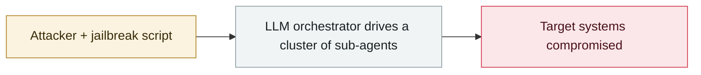

# First in-the-wild LLM agent running the full post-exploitation chain

     

## Summary

Sysdig's account. The entry point was a publicly exposed marimo notebook, **CVE-2026-39987** (a single WebSocket request yields a shell); cloud credentials were then harvested from environment files and an AWS credential store → used to **retrieve an SSH private key from AWS Secrets Manager** → **8 parallel SSH sessions** were opened against a downstream bastion → an internal PostgreSQL was fully exfiltrated. **The whole chain took about 1 hour; the database export itself took only 113 seconds.**

Key judgement: **this was not a pre-written script** — commands were composed in real time, each step adjusted to the target's feedback. Sysdig calls it **the first confirmed in-the-wild post-exploitation activity in which an LLM agent autonomously made decisions between steps, adapted to output and moved laterally without human guidance** (predating JADEPUFFER in 2026-07)

## Attack chain

## Sources

| # | Source | Link |
|---|---|---|
| 1 | THN | <https://thehackernews.com/2026/05/attackers-use-llm-agent-for-post.html> |
| 2 | CybersecurityNews | <https://cybersecuritynews.com/hackers-use-llm-agent-to-move-from-marimo-rce/> |

## Metadata

| Field | Value |
|---|---|
| Date | `2026-05-10` (raw: 2026-05-10, precision `day`) |
| Kind | Incident `incident` |
| Type | [`WEAPON`](../../taxonomy/types.md#weapon) Agent used as a weapon |
| Severity | **Critical** `critical` |
| Confidence | **A** — primary source (vendor / victim / law enforcement / official report) |
| Real harm | Yes |
| AI involvement | Confirmed `confirmed` |
| Region | [Global](../../regions/global.md) |
| Archive ID | `2026-05-10-first-in-wild-autonomous-llm-post-exploitation` |

**Why this classification:** Real incident with a confirmed victim. Rated `critical`: confirmed real damage at the multi-organization / government / critical-infrastructure / supply-chain-worm level, or a first-of-its-kind capability milestone with real victims. Grading criteria: see [taxonomy/severity.md](../../taxonomy/severity.md) and [taxonomy/confidence.md](../../taxonomy/confidence.md).

## Related

**Topic:** [Offensive AI capability evolution](../../topics/offensive-ai.md)

**Related records:**

- `2026-05-12` [GTIG AI threat tracker, 2026 edition](2026-05-12-gtig-wei-xie-zhui-zong.md)   GTIG AI threat tracker, 2026 edition
- `2026-04-08` [Aurora ransomware operators use Cursor Agent in live intrusions](../2026-04/2026-04-08-aurora-cursor-agent.md)   Aurora ransomware operators use Cursor Agent in live intrusions
- `2026-06-15` [UNC6508 breaches North American research institutions via REDCap](../2026-06/2026-06-15-unc6508-redcap-jing-ru-qin.md)   UNC6508 breaches North American research institutions via REDCap
- `2026-06-02` [CleverHans Lab adaptive AI worm PoC](../2026-06/2026-06-02-cleverhans-lab-poc.md)   CleverHans Lab adaptive AI worm PoC

---

[← 2026-05 index](README.md) · [← All records](../../README.md) · [Chinese](../i18n/zh/2026-05/2026-05-10-first-in-wild-autonomous-llm-post-exploitation.md)

This record is part of the **Orca AI Incident Archive**, licensed [CC BY 4.0](../../LICENSE). Found a factual error or a missing source? [Open an issue or PR](../../CONTRIBUTING.md) — corrections are recorded in the record's revision history, never silently overwritten.
