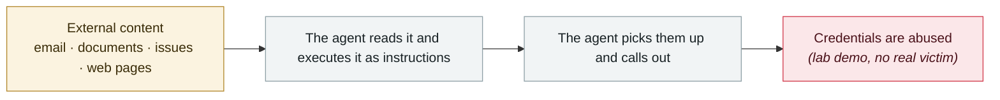

# ClaudeBleed: a zero-permission extension hijacks Claude for Chrome

      

## Summary

The extension's code lets **any script on the same origin** communicate with the Claude LLM without validating the caller

## Attack chain

## Sources

| # | Source | Link |
|---|---|---|
| 1 | CyberScoop | <https://cyberscoop.com/claude-chrome-extension-allows-plugins-to-hijack-ai/> |

## Metadata

| Field | Value |
|---|---|
| Date | `2026-05-12` (raw: 2026-05-12, precision `day`) |
| Kind | Research demo `research` |
| Type | [`IPI`](../../taxonomy/types.md#ipi) Indirect prompt injection · [`CRED`](../../taxonomy/types.md#cred) Credential abuse |
| Severity | **Medium** `medium` |
| Confidence | **B** — research lab or major outlet with checkable detail |
| Real harm | No |
| AI involvement | Confirmed `confirmed` |
| Region | [Global](../../regions/global.md) |
| Archive ID | `2026-05-12-claudebleed-claude-chrome` |

**Why this classification:** Controlled demo by a research lab or vendor, `real_harm: false`; the record marks when the attack surface became public. Rated `medium`: controlled demo, moderate flaw, or an incident limited to a single user / single machine. Grading criteria: see [taxonomy/severity.md](../../taxonomy/severity.md) and [taxonomy/confidence.md](../../taxonomy/confidence.md).

## Related

**Topic:** [Zero-click data exfiltration chain](../../topics/zero-click-exfil.md)

**Related records:**

- `2026-05-19` [TrapDoor: poisoning three ecosystems to corrupt AI assistant configs](2026-05-19-trapdoor-poisons-agent-configs.md)   TrapDoor: poisoning three ecosystems to corrupt AI assistant configs
- `2026-05-21` [Composio: agent automation itself becomes the privilege-escalation path](2026-05-21-composio-agent-automation-privesc.md)   Composio: agent automation itself becomes the privilege-escalation path
- `2026-05-11` [TanStack npm "Mini Shai-Hulud"](2026-05-11-tanstack-npm-mini-shai.md)   TanStack npm "Mini Shai-Hulud"
- `2026-05-18` [3,800 internal GitHub repositories compromised](2026-05-18-github-3800-internal-repos.md)   3,800 internal GitHub repositories compromised

---

[← 2026-05 index](README.md) · [← All records](../../README.md) · [Chinese](../i18n/zh/2026-05/2026-05-12-claudebleed-claude-chrome.md)

This record is part of the **Orca AI Incident Archive**, licensed [CC BY 4.0](../../LICENSE). Found a factual error or a missing source? [Open an issue or PR](../../CONTRIBUTING.md) — corrections are recorded in the record's revision history, never silently overwritten.
