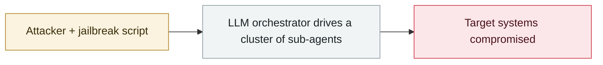

# GTIG AI threat tracker, 2026 edition

     

## Summary

See [§7.5](#75-offensive-ai-capability-evolutionweapon) for the full breakdown. New: **PROMPTSPY** (a backdoor that calls the Gemini API to operate an Android UI autonomously), AI-usage profiles for China-nexus actors such as UNC2814 / APT45 / APT27 / UNC6201 / UNC5673, and the LLM-access obfuscation industry (CLIProxyAPI, Claude-Relay-Service and others)

## Attack chain

## Sources

| # | Source | Link |
|---|---|---|
| 1 | GTIG | <https://cloud.google.com/blog/ja/topics/threat-intelligence/ai-vulnerability-exploitation-initial-access> |

## Metadata

| Field | Value |
|---|---|
| Date | `2026-05-12` (raw: 2026-05-12, precision `day`) |
| Kind | Threat report `report` |
| Type | [`WEAPON`](../../taxonomy/types.md#weapon) Agent used as a weapon |
| Severity | **Info** `info` |
| Confidence | **A** — primary source (vendor / victim / law enforcement / official report) |
| Real harm | n/a |
| AI involvement | Confirmed `confirmed` |
| Region | [Global](../../regions/global.md) |
| Archive ID | `2026-05-12-gtig-wei-xie-zhui-zong` |

**Why this classification:** Threat intelligence report covering several incidents; it is not counted as a single incident itself, so `severity` is recorded as `info`. Grading criteria: see [taxonomy/severity.md](../../taxonomy/severity.md) and [taxonomy/confidence.md](../../taxonomy/confidence.md).

## Related

**Topic:** [Offensive AI capability evolution](../../topics/offensive-ai.md)

**Related records:**

- `2026-05-10` [First in-the-wild LLM agent running the full post-exploitation chain](2026-05-10-first-in-wild-autonomous-llm-post-exploitation.md)   First in-the-wild LLM agent running the full post-exploitation chain
- `2026-04-08` [Aurora ransomware operators use Cursor Agent in live intrusions](../2026-04/2026-04-08-aurora-cursor-agent.md)   Aurora ransomware operators use Cursor Agent in live intrusions
- `2026-06-15` [UNC6508 breaches North American research institutions via REDCap](../2026-06/2026-06-15-unc6508-redcap-jing-ru-qin.md)   UNC6508 breaches North American research institutions via REDCap
- `2026-06-02` [CleverHans Lab adaptive AI worm PoC](../2026-06/2026-06-02-cleverhans-lab-poc.md)   CleverHans Lab adaptive AI worm PoC

---

[← 2026-05 index](README.md) · [← All records](../../README.md) · [Chinese](../i18n/zh/2026-05/2026-05-12-gtig-wei-xie-zhui-zong.md)

This record is part of the **Orca AI Incident Archive**, licensed [CC BY 4.0](../../LICENSE). Found a factual error or a missing source? [Open an issue or PR](../../CONTRIBUTING.md) — corrections are recorded in the record's revision history, never silently overwritten.
